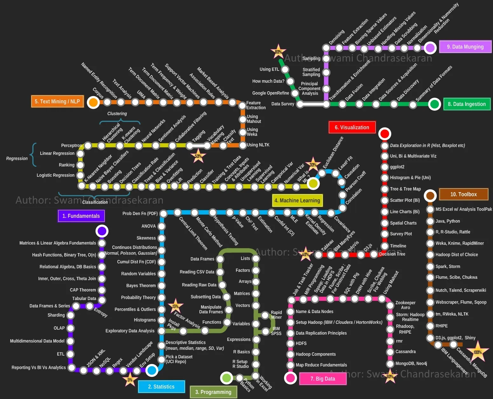

class: middle, center

# 工作内容和就业前景

---
# 2009年 科学范式的转变

Eugene Wigner’s article “The Unreasonable Effectiveness of Mathematics in the Natural Sciences” examines why so much of physics can be neatly explained with simple mathematical formulas such as f = ma or e = mc2. 

Meanwhile, sciences that involve human beings rather than elementary particles have proven more resistant to elegant mathematics. 

---
# 2009年 科学范式的转变

Economists suffer from physics envy over their inability to neatly model human behavior. 

An informal, incomplete grammar of the English language runs over 1,700 pages.

Perhaps when it comes to natural language processing and related fields, we’re doomed to complex theories that will never have the elegance of physics equations. 

---
# 2009年 科学范式的转变

But if that’s so, we should stop acting as if our goal is to author extremely elegant theories, and instead embrace complexity and make use of the best ally we have: the unreasonable effectiveness of data.

Norvig, Pereira, Halevy, “The Unreasonable Effectiveness of Data”, 2009

---
# 2014 数据科学家的兴起

- 数据
- 分析
- 知识

---
# 最新就业动向

各种岗位，都需要数字化人才。

比如HR岗位，现在企业更想招的是HRBP(合伙人)，不仅懂 人力资源知识，而且懂业务，甚至懂一些编程，数据分析。

比如:不仅懂和客户沟通，而且懂产品，能够根据客户的需求，和产品开发人员沟通，确定产品的下一步开发任务、计划，并支持销售进行下一步的产品销售。

---
# 最新就业动向

现在的产品，都是数字化产品，由程序控制，大数据支持，包括机器学习和人工智能。

因此，即使你是经济、机械、电子、土建等这些专业，也需要了解软件系统、大数据、机器学习、人工智能的知识，掌握基本的编程和数据分析技巧，掌握基本工具的原理和使用。这是数字化时代的通识教育的一部分

- 财新杂志，《就业为何难》，2023年8月14日，[链接](https://weekly.caixin.com/2023-08-12/102092433.html) 

---
# 数据科学家的工作

“Data scientists are the key to realizing the opportunities presented by big data. They bring structure to it, find compelling patterns in it, and advise executives on the implications for products, processes, and decisions. They find the story buried in the data and communicate it. And they don’t just deliver reports: They get at the questions at the heart of problems and devise creative approaches to them.”

http://hbr.org/2012/10/data-scientist-the-sexiest-job-of-the-21st-century/

---
# 大数据的 4V

- Volume：体量巨大
    - 以GB、TB、PB为处理单位
- Velocity：处理速度快
- Variety：类型繁多
- Value：价值密度低
    - 蕴藏有价值，但是每比特信息价值低，需要专⻔的工具挖掘
    - 通过小样本数据建立统计模型

---
# 大数据平台

- 阿里大数据平台
  - 大数据计算服务 MaxCompute，阿里云自主研发，提供针对 TB/PB 级数据分布式处理能力，应用于数据分析、挖掘、 商业智能等领域。阿里巴巴的数据业务都运行在 MaxCompute
- 华为大数据平台

---
#  大数据已在蓬勃发展

- 智慧交通
- 智慧安防
- 智慧工厂
- 智慧政府
- 智慧金融

---
# 数据量
- 我国网民数量居世界之首，每天产生的数据量也位于世界前列
- 一个互联网用户 1GB/天
- 一个智慧家居 10GB/天
- 一辆自动驾驶汽车 64TB/天
- 一架联网飞机 一家数字化工厂 200TB/天 1PB/天
- 一家热点资讯APP 50PB/天

---
# 大数据发展的两个动力
- 市场动力
  - 越来越多企业走向在线平台，生产运营数字化
- 技术动力
  - 云计算、人工智能、物联网、信息通信技术交织

---
# 中国的大数据战略
- 2017 年 12 月，习近平主持实施国家大数据战略第二次集体学习时强调，推动实施国家大数据战略，加快完善数字基础设施，推进数据资源整合和开放共享，保障数据安全，加快建设数字中国，更好服务我国经济社会发展和人民生活改善

---
# 中国的大数据战略

- 2020年，新冠肺炎疫情突袭。2月10日，习近平总书记在北京调研指导新型冠状病毒肺炎疫情防控工作时表示:“要运用大数据等手段，加强疫情溯源和监测。”

- 新华社北京2020年4月7日电题:习近平总书记近日在浙江考察时指出，“运用大数据、云计算、区块链、人工智能等前沿技术推 动城市管理手段、管理模式、管理理念创新，从数字化到智能化再到智慧化，让城市更聪明一些、更智慧一些，是推动城市治理 体系和治理能力现代化的必由之路，前景广阔”

---
# 大数据两大职业方向

- 大数据工程
- 大数据分析

---
# 大数据工程

- 数据管理
    - Python/SQL/Excel
    - 数据库/Hadoop
- 大数据运维
    - 系统搭建调试
- 系统研发
    - 分布式系统开发
- 架构师
    - 客户需求分析
    - 系统架构设计

---
# 大数据分析

- 数据管理
    - Python/SQL/Excel
    - 数据库
    - Hadoop
    - 云计算
- 运营报表
    - KPIs和数据分析
    - 沟通能力

---
# 大数据分析

- 洞察分析
    - 营销分析与优化
    - 特定业务问题分析
    - 战略分析
    - PPT演示
- 算法模型
    - 统计检验与回归
    - 决策树
    - 人工智能
    - 篮分析

???
未来十年的科技人才趋势

- 人工智能专家
    - 深度掌握神经网络，掌握自然语言处理、图像识别技术 
    - 现有人才:1000 – 2000 未来5年:需求5 – 8万
- 机器学习工程师
    - 了解统计学与概率论、掌握机器学习算法、平台和工具等
    - 现有人才:5000 – 8000 未来5年:需求20 – 30万

---
# 未来十年的科技人才趋势

- 大数据工程师
  - 数学基础和算法基础，掌握 Hadoop，Spark 等开发框架，熟练应用大数据分析和工具等
  - 现有人才: 8 – 10万
  - 未来5年: 需求 100 – 120 万

???
- Java/Python工程师
    - 现有人才:100万 未来5年:需求800 – 1000万

---
# 大数据专业就业岗位

- 数据分析师
- 数据科学家
- 大数据工程师

---
# 数据分析师
  - 分析与清洗
  - DATA ANALYST “数据侦探”
  - 在指导下获取、处理并总结数据
  - 能够完成数据清洗的工作
  - 使用已有的算法和工具进行数据分析

---
# 数据科学家
  - 算法与建模
  - DATA SCIENTIST
  - “跟独⻆兽一样稀罕”
  - 独立研究和解决问题的能力
  - 更深的定量分析学科基础知识，例如计算机科学、统计、物理或应用数学

---
# 大数据工程师
  - BIG DATA ENGINEER “职业的软件工程师”
  - 数据库系统的编译、安装及部署 - 复杂的查询处理、系统开发
  - 集群的维护、扩展、灾难恢复

---
# 技能
- 商业 
    - 产品开发
- 技术 
    - 机器学习、大数据
- 数学 
    - 优化、⻉叶斯
- 编程 
    - Python、Spark、R
- 统计
  - 可视化、时间统计、经典统计

???
NYU – Intro to Data Science Copyright: Brian d’Alessandro

---
# 技能

.center[.width-90[]]

---
# AI 技能

- 练习在 AI 的帮助下，探索学习一个话题
- 一起探索吧([阿里通义 APP 链接](https://m.tongyi.aliyun.com/app/tongyi/tongyi-hybrid/share-result?shareId=19913999-ec8f-4e7e-a996-d4921734d61b))
- 非常耐心的导师([阿里通义网页](https://t.aliyun.com/U/93YWTT))
- 下载和安装“通义千问” APP，或者网页注册 
- 探索一个课上讲过的话题
