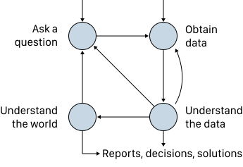

class: middle, center

# 数据科学生命周期

---
# 内容

- 数据科学生命周期
- 生命周期的各个阶段
- 生命周期示例
- 小节

---
# 概览
- 目的：从 messy 数据中，获得 insight，帮助决策
- 方法：统计，CS
- 学习：在具体问题（Problem）的上下文（Context）下思考

---
# 理解世界
- 把发现的规律，趋势，推而广之，到更多数据，场合去验证，看它是不是通用的
- 推理（ inference ）
    - 从 sample 到 population
    - A/B 测试，置信区间
- 预测
    - 预测间隔，训练集-测试集

---
# 问题
- 疫苗是否有效？
- 新闻是否可信？
- 气候如何变化？
- 政策是否合理？

---
class: middle, center
# 数据科学工作流程

.center[.width-80[]]

四步：问问题、获得数据、理解数据、理解世界

输出：报告、决策、解决方案

---
# 核心：提出好的问题
- 四种问题
- 描述性
    - 房价随时间会怎么变？
- 探索性
    - 房子的哪些方面和售价有关？
- 推理性
- 预测性

---
# 关键：一个能被数据回答的问题
- 方法
    - 咨询参与研究的人
    - 找出要测量什么
    - 设计数据收集方法
- 目标
    - 清晰（clear）
    - 聚焦（focused）
    - 有意义

---
# 问题
- 我们想研究什么现象？
- 某种人群的特征？
- 物理模型？
- 社会行为？

---
# 数据科学的生命周期
- 开始 分析，研究问题
- 探索性的数据分析
    - 这是关键
- 可视化，发现有趣的模式，趋势，总结数据
    - 描述性分析
    - 探索性的数据分析
- 寻找数据的不足
- 不断迭代
    - 理解数据，回过头来 清洗数据，获得更多数据
    - 基于数据的限制，调整 研究问题
