class: middle, center

# 探索性数据分析

---
# 内容

- 特征类型
- 在分布中寻找什么
- 在关系中寻找什么
- 多变量设置的比较
- 探索指南
- 示例：房屋销售价格

---
# 探索式数据分析

- EDA：Exploratory data analysis
- 50 多年前，John Tukey 提出
- 区别于统计学的假设检验、置信区间、模型
- 一种哲学方法

---
class: middle, center
# 探索式数据分析

Exploratory data analysis is actively incisive, rather than passively descriptive, with real emphasis on the discovery of the unexpected.

探索性数据分析是主动的深入分析，而不是被动的描述性分析，强调意外发现

---
# 探索式数据分析
- 在 EDA 中，我们进入一个发现的过程，不断提出问题并深入未知的领域来探索想法
- 使用绘图来揭示数据的特征，检查值的分布，并揭示无法从简单的数值摘要中检测到的关系
- 这种探索涉及转换、可视化和总结数据，以建立和确认我们的理解，识别和解决数据的潜在问题，并为后续分析提供信息

---
# 可视化
- 根据 Tukey, 可视化是 EDA 的核心
- The greatest gains from data come from surprises… The unexpected is best brought to our attention by pictures
- 数据的最大收获来自惊喜 …… 图片是用意外事件引起我们的注意的最好方法。

---
# 可视化
- 选择正确的图，正确的理解
- 如何读图、在图中寻找什么，如何理解
- 但要小心，一些结果可能是肤浅的

---
# 可视化
- 如何 让 我们的 视觉 argument clear 和 compelling
- EDA 很有趣！但这需要练习
- 学习如何进行 EDA 的最佳方法之一是向其他人学习，因为他们在探索数据时描述了他们的思维过程
- 下面从案例研究中揭示 EDA 思维

---
# 步骤

第一步，确定 Feature 类型
- 分类数据 qualitative
- 定量数据 quantitative 

---
# 分类数据 qualitative
- 分类数据 categorical
- nominal 名称
  - windows， linux
  - 没有内在的顺序
- ordinal
  - 衣服大小：X，XXL
  - 教育级别：高中、大学
  - 有内在顺序

---
# 定量数据 quantitative 
- numeric
- discrete numeric
- continuous numeric

---
# 狗狗可视化

狗狗协会，[血统数据](https://informationisbeautiful.net/visualizations/best-in-show-whats-the-top-data-dog/)，  172 个 breed

.center[.width-100[]]

---
# 狗狗数据概览

      dogs = pd.read_csv('data/akc.csv')

      dogs.info()
- 总结
  - shape
  - feature
  - non-null count
  - dtype
  - memory usage

---
# 确定数据类型

- repetition
  - 包括 range string： <5, 15-25， 所以 它是 ordinal
  - 在狗理解你的一个命令之前，需要重复命令的次数
- ailments
  - float64 类型，但只有 8 个值，比如 1.0
  - 看数据说明，代表严重遗传疾病的数量
  - 所以用 discrete numeric
- breed 
  - 正好 172 个，可以做 Primary key
  - nominal（没有顺序的 categorical）

---
# 变换 qualitative 特征
- 重新标记类别，使其信息更丰富
- 折叠类别，以简化可视化
- 将数字特征转换为序数，以关注特定的转变点

---
# 重新标记类别，显示丰富信息

- children
  - 取值 0，1，2，表示是否适合儿童
  - 变为 字符串，画图，统计都方便，也不会错误地去算它的 均值 等了
  - 但会增加存储空间

      kids = {1:"high", 2:"medium", 3:"low"}

      dogs = dogs.assign(kids=dogs['children'].replace(kids))
  
---
# 三类儿童适合的狗狗数

      toy_dogs = dogs.query('group == "toy"')
          .groupby('kids').count().reset_index()
BAR 图

      px.bar(toy_dogs, x='kids', y='breed', 
          width=350, height=250,
          category_orders=
              {"kids": ["low", "medium", "high"]},
          labels=
              {"kids": "Suitability for children", 
                    "breed": "count"})

---
# 三类儿童适合的狗狗数

重新标记了 Child 类别，显示丰富信息

.center[.width-80[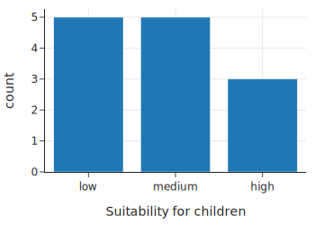]]

---
# 折叠类别以简化可视化
  
把 toy 和 non-sporting 狗，合并 为 play 狗

加一列 play，是 bool 类型

      with_play = dogs.assign(
            play=(dogs["group"] == "toy") |
                  (dogs["group"] == "non-sporting"))

---
# 将数字特征转换为序数

关注特定的转变点

合并超过4个疾病数 ailment：4+

注意：pandas 2022年实现了 category dtype，但 一些 可视化库，支持不够，所以用得还不多

---
# 不同类型特征，不同可视化图

- 单个定量特征
  - rug plot
  - histogram
  - density curve
  - box plot
  - violin plot

---
# 不同类型特征，不同可视化图

- 两个定量特征
  - scatter plot
  - smooth curve
  - contour plot
  - heat map
  - quantile quantile plot

---
# 不同类型特征，不同可视化图

- 单个定性特征
  - bar plot
  - dot plot
  - line plot
  - pie chart

- 两个定性特征
  - side-by-side bar plots
  - mosaic plot
  - overlaid lines

---
# 不同类型特征，不同可视化图

- 一个定性特征与一个定量特征
  - overlaid density curves
  - side-by-side box plots
  - overlaid smooth curves
  - quantile quantile plot

---
# 不同类型特征，不同总结统计

- 定量特征
  - count， fraction， percentage of each category
- 定性特征
  - mean，median，standard deviation
  - inner quartile range（75th percentile to 25th percentile）
  - nth percentile： 值 q 使得 n% 的数据值等于或低于它
      - np.percentile(data, method='lower')

---
# 内容

- 特征类型
- .red[在分布中寻找什么]
- 在关系中寻找什么
- 多变量设置的比较
- 探索指南
- 示例：房屋销售价格

---
# 从 分布中 观察什么？

人的视觉观察，对模式，很敏感

可视化，观察“模式”，很重要

观察狗狗寿命分布：rug + 直方图

    px.histogram(dogs, x="longevity", marginal="rug", 
          nbins=20, histnorm='percent', 
          width=350, height=250,
          labels={'longevity':'Typical lifespan (yr)'},
          )

    fig.update_traces(marker_line_width=1, 
          marker_line_color="black")

---
# 狗狗寿命分布

- .center[.width-80[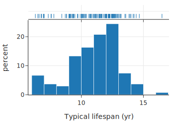]]
  - 上方 rug 对 小数据 还不错。如果数据密，就看不出来
  - 直方图可以

---
# 狗狗寿命分布

密度曲线（kernel density estimate：KDE）更细致 地 显示 分布 情况

      from scipy.stats import gaussian_kde

      new_x = dogs['longevity'].dropna()
      bandwidth = 0.2
      xs = np.linspace(min(new_x), max(new_x), 100)
      ys = gaussian_kde(new_x, bandwidth)(xs)

      f2 = go.Figure(go.Scatter(x=xs, y=ys))
      f2.update_xaxes(range=[4.5, 18.5], 
            title="Typical lifespan (yr)")
      f2.update_layout(showlegend=False,
            width=350, height=250)
      f2.show()

---
# 狗狗寿命分布

- .center[.width-80[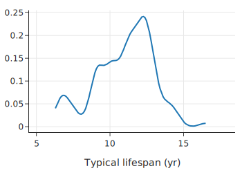]]
    - mode （高点）在 12 年
    - 肩 在 9-11 年

---
# 描述分布的特性

- 对称
- 偏斜
- modes：高频区域的数量、位置和大小
- 长尾：通常与钟形曲线相比
- gaps： 没有观察到任何值
- 异常大或异常的值

---
# 描述分布的特性

.center[.width-100[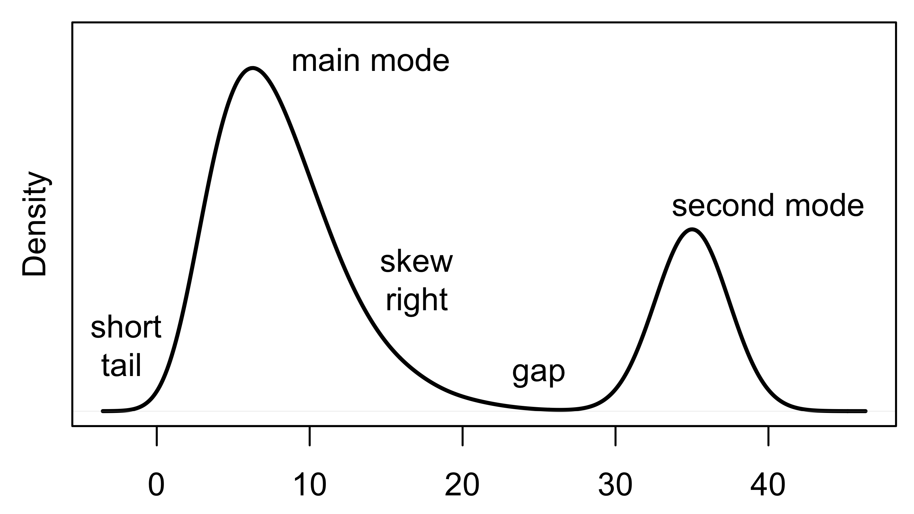]]

---
# 分桶（bin）

    bins = [-0.5, 0.5, 1.5, 2.5, 3.5, 9.5]

    g = sns.histplot(data=dogs, x="ailments",
            bins=bins, stat="density")

    g.set(xlabel='Number of ailments', ylabel='density');
- 根据 需求 设置 bin
  - 前面 宽度 1，后面 宽，这样可以 避免 小值 的 fluctuations， 平滑 这个 分布
  - 做了 平滑： 隐藏了 单个 rug 的 细节， 从而观察 分布 的 一般特征、趋势
  - 因为数据只是 sample，所以 附近也应该有值的

---
# 疾病数量分布

- .center[.width-70[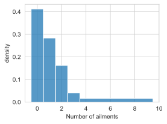]]
  - 在 0 处 单峰（unimodal）
  - 往左倾斜 （heavily skewed to the left）
  - 右长尾（long right tail）

???
Bar 和 直方的区别

- 直方图
  - y 轴是密度，即 面积 为 1
- Bar图
  - x 轴：categorical
  - y 轴：出现频次

.center[.width-100[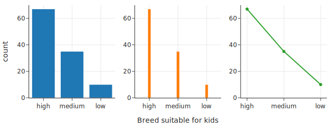]]

      kid_counts = dogs.groupby(['kids']).count()
      
      kid_counts = kid_counts.reindex(["high", "medium", "low"])

      fig = make_subplots(rows=1, cols=3)

      fig.add_trace(go.Bar(x=kid_counts.index, y=kid_counts['breed']), row=1, col=1)

      fig.add_trace(go.Bar(x=kid_counts.index, y=kid_counts['breed']), row=1, col=2)
      fig.update_traces(width=0.1, row=1, col=2)

      fig.add_trace(go.Scatter(x=kid_counts.index, y=kid_counts['breed'], mode='markers+lines'), row=1, col=3)

      fig.update_xaxes(title='Breed suitable for kids', row=1, col=2)
      fig.update_yaxes(title='count', row=1, col=1)

      fig.update_yaxes(range=[0,70])
      fig.update_layout(showlegend=False,width=650, height=250)              
      fig.show()

---
# 内容

- 特征类型
- 在分布中寻找什么
- .red[在关系中寻找什么]
- 多变量设置的比较
- 探索指南
- 示例：房屋销售价格

---
# 观察两个特征间的关系

- 两个数量特征
- scatter 图
  - 二维 rug 图
  - 观察 线性 还是 非线性 关系
      - 能不能 变换 为 线性 关系？
  - 关系的 强度

---
# 高度和重量的关系

    px.scatter(dogs, x='height', y='weight', 
          marginal_x="rug", marginal_y="rug",
          labels={'height':'Height (cm)', 
                'weight':'Weight (kg)'},
          width=350, height=250)

---
# 高度和重量的关系
- .center[.width-100[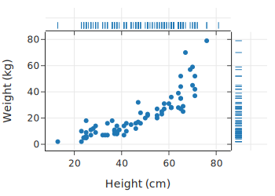]]
  - 非线性，为什么？立方的关系

---
# 一个定量和一个定性

用定性特征对数据分组，然后画定量（概率密度）

      fig = plt.figure(figsize=(6, 3))
      ax = sns.kdeplot(data=dogs, x='height', hue='size')
      ax.set(xlabel='Height (cm)', ylabel='')
      ax.get_legend().set_title("Size")

      lss = ['-', '--', '-.']

      handles = ax.legend_.legend_handles[::-1]

      for line, ls, handle in zip(ax.lines, lss, handles):
          line.set_linestyle(ls)
          handle.set_ls(ls)

---
# 一个定量和一个定性

- .center[.width-100[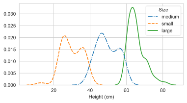]]
    - bimodal 双峰
    - left mode 更大
    - 小、中组 的 spread 更大

---
# 画 box 图
- 也叫 box-and-whisker 图
- 画出重要统计信息
  - 25th percentile，median，75th percentile
  - 须子（whiskers）显示尾巴，还有异常大或小的值
- 可以看出是否对称

.center[.width-80[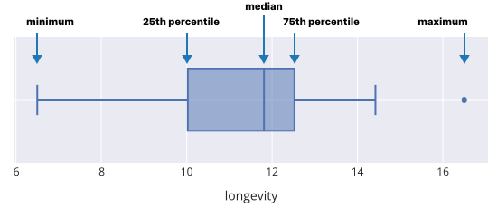]]

---
# 比较 各组的 分布

    fig = make_subplots(rows=1, cols=2)

    fig.add_trace(go.Box(x=dogs["size"], y=dogs["height"]), 
        row=1, col=1)
    fig.add_trace(go.Violin(x=dogs["size"], y=dogs["height"]), 
        row=1, col=2)

    fig.update_yaxes(range=[0, 90])
    fig.update_yaxes(title="Height (cm)", row=1, col=1)
    fig.update_xaxes(
        categoryarray=["small", "medium", "large"], 
        categoryorder="array", title = "Size"
    )    
    fig.update_layout(showlegend=False, width=550, height=250)

    fig.show()

---
# Box 图 和 小提琴图

- .center[.width-100[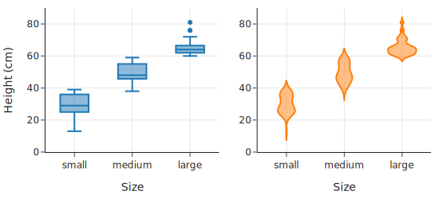]]
  - 小提琴图有 密度 信息，能看出 双峰
  - Box 图的三个 box 不重叠，更清楚地显示 size 可以用 height 区分
    - 也能看到 大狗 的 spread 更窄
    - 小提琴做了 平滑，就看不出来了

---
# 两个定性特征

计算 三种 儿童适应度 的 狗 的 三种 size 的 比例

    def proportions(series):
        return series / sum(series)

    counts = (dogs.groupby(['kids', 'size'])
        .size()
        .rename('count'))

    prop_table = (counts
        .unstack(level=1)
        .reindex(['high', 'medium', 'low'])
        .apply(proportions, axis=1))

    prop_table_t= prop_table.transpose()

---
# 线图

三种 儿童适应度 的 狗 的 三种 size 的 比例

    fig = px.line(prop_table_t, y=prop_table_t.columns,
            x=prop_table_t.index, line_dash='kids',
            markers=True, width=500, height=250)

    fig.update_layout(
        yaxis_title="proportion", xaxis_title="Size",
        legend_title="Suitability  for children"
      )

---
# 线图

每种 儿童适应度 的 狗 的 大小 分布

.center[.width-100[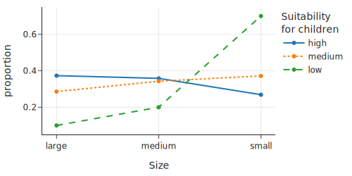]]

---
# 并排 条形图

方便对比

    fig = px.bar(prop_table_t, 
            y=prop_table_t.columns, 
            x=prop_table_t.index,
            barmode='group', 
            width=500, height=250)

    fig.update_layout(
        yaxis_title="proportion", xaxis_title="Size", 
        legend_title="Suitability  for children"
    )

---
# 并排 条形图

比较 各种 儿童适应度 的 狗 的 大小 分布

.center[.width-100[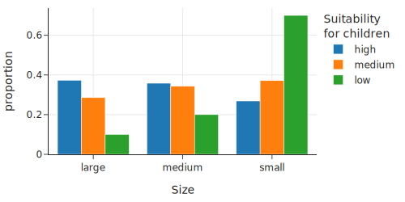]]

---
# 练习

- 比较 各种 儿童适应性 的 狗 中， 不同 size 的 比例
  - 即：横轴 变为 适应性
- 比较，说明这两种图，分别适用于什么场景？哪种是你关心的？

---
# 内容

- 特征类型
- 在分布中寻找什么
- 在关系中寻找什么
- .red[多变量设置的比较]
- 探索指南
- 示例：房屋销售价格

---
# 多变量的比较

“重复次数”从 6 种 缩小到 4 种，以便更好观察 关系

      rep_replacements = {
          '80-100': '40+', '40-80': '40+', 
          '<5': '<15', '5-15': '<15',
      }
      dogs = dogs.assign(
          repetition=dogs['repetition'].
              replace(rep_replacements))

---
# 用 不同形状的标记符号 表示

    px.scatter(dogs.dropna(subset=['repetition']), 
          x='height', y='longevity', 
          symbol='repetition', 
          width=450, height=250,
          labels={'height':'Height (cm)', 
                'longevity':'Typical lifespan (yr)',
                'repetition':'Repetition'},
        )

---
# 用 不同形状的标记符号 表示

混在一起，比较难分清楚

.center[.width-100[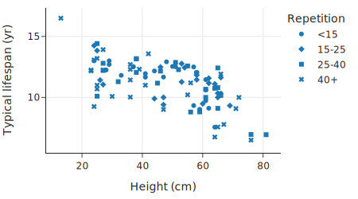]]

---
# Facet plots 多面图

两定量和一个定性

scatter plot，用 markers 或者 panels

      px.scatter(dogs.dropna(subset=['repetition']), 
           x='height', y='longevity', 
           trendline='ols', 
           facet_col='repetition', 
           facet_col_wrap=2,
           labels={'height':'Height (cm)', 
                'longevity':'Typical lifespan (yr)'})

---
# 多面图

- .center[.width-80[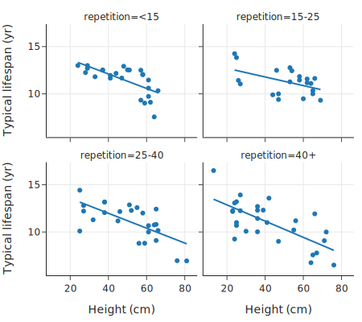]]
  - 大狗的 寿命 短一些

---
# 总结

- 两定量和一个定性
  - scatter plot，用 markers 或者 panels
- 两定性和一个定量
  - side-by-side box plots
  - 根据 定性特征 之一 将 箱线分组

---
# 总结
- 三个定量
  - 将 定量特征之一 转换为 有序特征，其中每个类别通常具有大致相同数量的记录。
  - 然后制作 多面散点图
- 三个定性
  - 根据特征级别的组合对数据进行细分，
  - 使用线图、点图、并排条形图等比较这些比例
  - 随着进一步细分，这些图往往会变得越来越难以理解
      - 维数诅咒
---
# 维数诅咒

- 随着类别可能组合数量的增加，涉及多个类别变量的比较很快就会变得很麻烦
  - 例如，有 3 × 4 = 12 种大小重复组合
- 子组中观测值太少
  - 尽管狗数据框中有近 200 行，但一半的大小重复组合具有 10 个或更少的观察值。 
  - 当一个特征缺失值时，就会失去观察结果，使情况更加复杂
- 将关系与定量数据比较时
  - 如果只有三个定量变量，分面图中的某些散点图很容易具有太少的观测值，无法确认子组的两个变量之间的关系形状

---
# 特征控制

- 分解可视化，以查看由 定性特征 确定的数据子组的关系是否发生变化，是一种很好的做法。
- 例如，当散点图中具有上升趋势的线性关系在散点图的某些或所有方面反转为下降趋势时，您可能会感到惊讶。这种现象被称为辛普森悖论。
- 这种悖论也可能发生在定性特征上。
- 伯克利大学发生了一个著名的案例，当时男性研究生的入学率高于女性，但在每个项目中进行审查时，女性的入学率却偏高。问题是，越来越多的女性申请入学率较低的项目。

???
https://pubmed.ncbi.nlm.nih.gov/29484824/

---
# 内容

- 特征类型
- 在分布中寻找什么
- 在关系中寻找什么
- 多变量设置的比较
- .red[探索指南]
- 示例：房屋销售价格

---
# EDA 关注问题

- 特征X的值是如何分布的？
- 特征 X 和特征 Y 彼此之间有何关系？
- 特征 X 的分布在特征 Z 定义的子组中是否相同？
- X 中是否有任何不寻常的观察结果？在 (X,Y) 的组合中呢？在 Z 定义的子群中呢？

---
# EDA 技巧

- 将你的答案与测量的特征和上下文联系起来
- 采用积极、好奇的方式进行调查。
- 问自己“下一步是什么（what next）”和“那又怎样（so what）”，如：
  - 是否有理由预期一组/观察结果可能会有所不同？
  - 为什么这个shape的发现可能很重要？
  - 再做哪些比较可能有用？
  - 是否有任何潜在的重要特征可供比较/对照？

---
# EDA 技巧

- 在此过程中，有时离开计算机来仔细思考您的发现，非常重要！
  - 阅读有关该主题的文献、与该领域的专家讨论您的发现
  - 例如，异常观察可能有充分的理由，该领域的某人可以帮助澄清并提供更多背景。

---
# 内容

- 特征类型
- 在分布中寻找什么
- 在关系中寻找什么
- 多变量设置的比较
- 探索指南
- .red[示例：房屋销售价格]

---
# 案例：房价分析

- 首先分析数据粒度（granularity）
  - 销售记录
  - 521491 rows × 8 columns
- 确定主键（primary key）
  - sfh_df.info()
  - 组合 city, zip code, street address, and date
- “价格”是关注点

---
# 理解价格

观察分布

    # This option stops scientific notation for pandas
    pd.set_option('display.float_format', '{:.2f}'.format)

    percs = [0, 25, 50, 75, 100]
    prices = np.percentile(sfh_df['price'], percs, 
          method='lower')

    pd.DataFrame({'price': prices}, index=percs)
发现：高价房特别高，最大值 20M 是 中值 的 40 倍

---
# 细看高价房的分布

      percs = [95, 97, 98, 99, 99.5, 99.9]
      
      prices = np.percentile(sfh_df['price'], 
            percs, method='lower')
      
      pd.DataFrame({'price': prices}, index=percs)
发现：99.9% 在 4M 以下

---
# 选 4M 以下房子，观察分布

    under_4m = sfh_df[sfh_df['price'] < 4_000_000].copy()
    px.histogram(under_4m, x='price', nbins=50, width=350, height=250, 
        labels={'price':'Sale price (USD)'})
- .center[.width-70[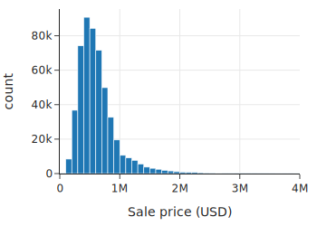]]
  - 向右偏斜，单峰（single mode）

---
# log 变换

      under_4m['log_price'] = np.log10(under_4m['price'])
      px.histogram(under_4m, x='log_price', nbins=50, 
            width=350, height=250, 
            labels={'log_price':'Sale price (log10 USD)'})
.center[.width-60[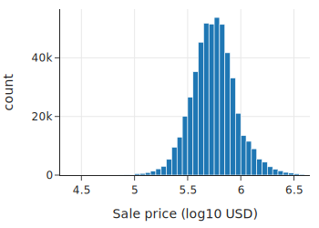]]
对称了！

---
# 问问题：what next？
- 看 上下文 （context）
- 和 销售年份 是否有关？
    - 房价 一直在涨，然后 暴跌
- 固定“年份”
    - 其它因素的影响？
    - 面积？

---
# 取子集

      def subset(df):
          return df.loc[(df['price'] < 4_000_000) &
                        (df['bsqft'] < 12_000) & 
                        (df['timestamp'].dt.year == 2004)]

      sfh = sfh_df.pipe(subset)

---
# size 也 log

    sfh = sfh.assign(log_bsqft=np.log10(sfh['bsqft']))

    fig = make_subplots(1,2)
    fig.add_trace(go.Histogram(x=sfh['bsqft'], 
            histnorm='percent', 
            nbinsx=60), row=1, col=1)
    fig.add_trace(go.Histogram(x=sfh['log_bsqft'], 
            histnorm='percent', 
            nbinsx=60), row=1, col=2)

    fig.update_xaxes(title='Building size (ft²)', 
        row=1, col=1)
    fig.update_xaxes(title='Building size (ft², log10)', 
        row=1, col=2)
    fig.update_yaxes(title="percent", row=1, col=1)
    fig.update_yaxes(range=[0, 18])
    fig.update_layout(width=450, height=250, showlegend=False)

---
# size 也 log

确实 log 后就对称了

.center[.width-100[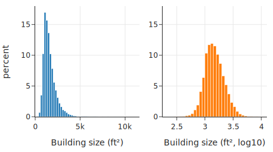]]

---
# 卧室数

离散 quantitative 变量
  
bar 图

    eight_up = sfh.loc[sfh['br'] >= 8, 'br'].unique()
    sfh['new_br'] = sfh['br'].replace(eight_up, 8)

    br_cat = sfh['new_br'].value_counts().reset_index()
    px.bar(br_cat, x="new_br", y="count", 
            width=350, height=250,
            labels={'new_br':'Number of bedrooms'})

---
# 卧室数分布

.center[.width-80[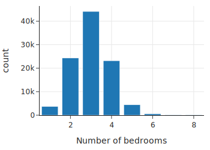]]

---
# Pipeline

    def log_vals(df):
        return df.assign(log_price=np.log10(df['price']),
                        log_bsqft=np.log10(df['bsqft']),
                        log_lsqft=np.log10(df['lsqft']))

    def clip_br(df):
        eight_up = df.loc[df['br'] >= 8, 'br'].unique()
        new_br = df['br'].replace(eight_up, 8)
        return df.assign(new_br=new_br)

    sfh = (sfh_df
        .pipe(subset)
        .pipe(log_vals)
        .pipe(clip_br))

---
# 卧室数与房价关系

    px.box(sfh, x='new_br', y='price', log_y=True, 
          width=450, height=250, 
          labels={'new_br':'Number of bedrooms',
          'price':'Sale price (USD)'})
.center[.width-80[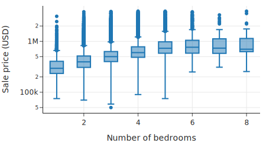]]

---
# 每平米房价

      def compute_ppsf(df):
          return df.assign(
              ppsf=df['price'] / df['bsqft'], 
              log_ppsf=lambda df: np.log10(df['ppsf']))

      sfh = (sfh_df
        .pipe(subset)
        .pipe(log_vals)
        .pipe(clip_br)
        .pipe(compute_ppsf)
      )

---
# 地块！

    cities = ['Richmond', 'El Cerrito', 'Albany', 
          'Berkeley', 'Walnut Creek', 
          'Lamorinda', 'Piedmont']

    px.box(sfh.query('city in @cities'), 
          x='city', y='price', 
          log_y=True, width=450, height=250, 
          labels={'city':'', 'price':'Sale price (USD)'})

---
# 地块与房价关系

.center[.width-100[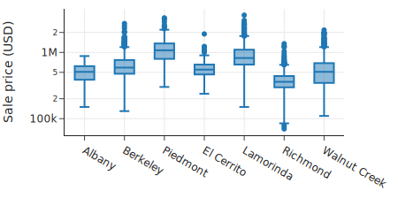]]

---
# 不同城市 建筑面积 和 单位房价

    four_cities = ["Berkeley", "Lamorinda", 
            "Piedmont", "Richmond"]

    fig = px.scatter(sfh.query("city in @four_cities"),
        x="bsqft", y="log_ppsf", 
        facet_col="city", facet_col_wrap=2,
        labels={'bsqft':'Building size (ft^2)', 
                'log_ppsf': "Price per square foot"}, 
        trendline="ols", trendline_color_override="black",
    )

    fig.update_layout(xaxis_range=[0, 5500], yaxis_range=[1.5, 3.5], width=450, height=400)
    fig.show()

---
# 不同城市 建筑面积 和 单位房价

.center[.width-70[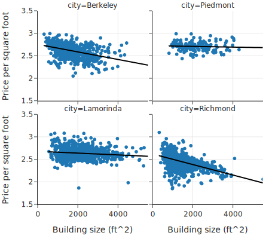]]
- 不同城市不一样

---
# 发现小结

- 销售价格和建筑尺寸严重偏向右侧，单峰
- 每平方英尺的价格随着建筑尺寸的变化呈非线性下降
- 较小的房屋每平方英尺的成本比较大的房屋更高
- 大型房屋的每平方英尺价格大致恒定
- 更理想的位置会增加销售价格，导致不同面积的房屋，每平米单价大致相同
- 如果考虑时间，还要考虑通胀

---
# 总结
- 特征类型
  - nominal, ordinal, numerical
- 根据文档、领域知识，确定它们
- 各种图的理解、模式发现

---
# 培养对特征分布和关系的直觉
- 在绘图之前猜测将看到什么
  - 尝试绘制或描述您认为的分布形状，然后绘图
      - 例如，其值具有自然下限/上限的变量往往在界限的相反方向上有长尾
      - 收入分配（下界为 0）往往有一条长右尾，而考试成绩（上界为 100）往往有一条长左尾。
  - 可以对关系的形状做出类似的猜测
    - 我们发现价格和房屋面积几乎呈双对数线性关系
- 获得对形状的直觉后，EDA 就会变得更容易
  - 可以更轻松地识别绘图何时显示出令人惊讶的形状
  - 因为 可视化的  关键是 令人惊讶！

---
# 练习

textbook-mastercontent/ch/10

1-eda_feature_types.ipynb
2-eda_distributions.ipynb
3-eda_relationships.ipynb
4-eda_multi.ipynb
5-eda_example.ipynb
