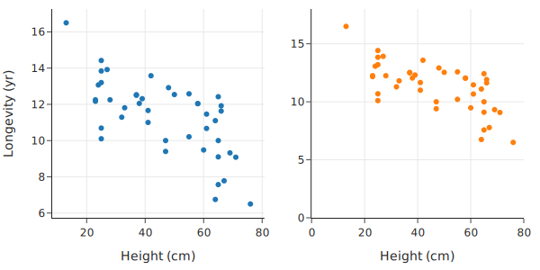
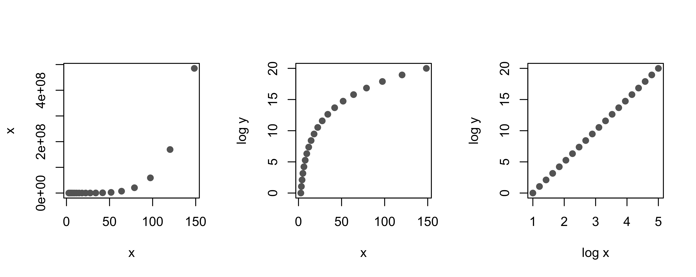

class: middle, center

# 数据可视化

---
# 内容

- 选择尺度来揭示结构
- 平滑和聚合数据
- 促进有意义的比较
- 结合数据设计
- 添加上下文
- 使用plotly 创建绘图
- 其他可视化工具

---
# 可视化
- 一张图，应该有一个 Message
  - 图的目的是：尽可能清晰地 传递 这个 message
- 原则
  - 选择 轴 的 尺度
  - 平滑、合并
  - 比较
  - 设计
  - 上下文信息
- plotly

---
# 选择 轴 的 尺度
- 展示结构
- 调整轴的取值范围
- 放置 刻度线（tick mark）
- 变换

---
# 选择 轴 的 尺度
.center[.width-80[]]

2M 以下，2M-8M 分为两个图

???
      px.histogram(sfh, x='price', nbins=100,
             labels={'price':"Sale price (USD)"}, 
             width=350, height=250)

---
# 选择 轴 的 尺度
.center[.width-100[]]

设置 x 轴的范围

2M 以下，2M-8M 分为两个图

能看到 左图中的 第二个 峰了

???
      right_hist = px.histogram(sfh, x='price')
      left_hist = px.histogram(sfh, x='price')
      # We wrote the left_right function as a shorthand for plotly's make_subplots
      fig = left_right(left_hist, right_hist, height=250)
      fig.update_xaxes(range=[0, 2e6], title_text="Sale price (USD, under $2M)", row=1, col=1)
      fig.update_xaxes(range=[2e6, 9e6], title_text="Sale price (USD, over $2M)", row=1, col=2)
      fig.update_yaxes(range=[0, 10], row=1, col=2)
      fig

从 0 开始？

---
# 轴 可以 不从 0 开始

.center[.width-100[]]

利用宝贵的展示空间，减少空白

???
      fig = make_subplots(rows=1, cols=2)

      fig.add_trace(
          go.Scatter(x=dogs['height'], y=dogs['longevity'], mode="markers"),
          row=1, col=1
      )

      fig.add_trace(
          go.Scatter(x=dogs['height'], y=dogs['longevity'], mode="markers"),
          row=1, col=2
      )

      fig.update_xaxes(range=[0, 80], row=1, col=2, title_text="Height (cm)")
      fig.update_yaxes(range=[0, 18], row=1, col=2)
      fig.update_xaxes(row=1, col=1, title_text="Height (cm)")
      fig.update_yaxes(row=1, col=1, title_text="Longevity (yr)")

      fig.update_layout(height=300, width=600, showlegend=False)
      fig.show()

---
# Bar 图，最好从 0 开始

.center[.width-100[]]

左图，从 0 开始，高度对应数值，直观

右图，给人错觉，似乎差别更大

???
      dogs_lon = dogs.groupby('size')['longevity'].mean().reset_index()
      sml = {"size": ['small', 'medium', 'large']}

      left = px.bar(dogs_lon, x='longevity', y='size', category_orders=sml)
      right = px.bar(dogs_lon, x='longevity', y='size', category_orders=sml)
      fig = left_right(left, right, height=250)
      fig.update_xaxes(range=[7, 13], row=1, col=2)
      fig.update_xaxes(title_text='Typical longevity (yr)')
      fig.update_layout(yaxis_title="")
      fig.show()

---
# 比例 最好 从 0 开始

.center[.width-80[]]
  因为比例 是 从 0 到 1 的

???
      size_props = ((dogs['group'].value_counts() / len(dogs))
            .reset_index()
            .rename(columns={'count': 'proportion'}))

      fig = px.scatter(size_props, x='proportion', y='group',
                      width=350, height=250)
      fig.update_traces(marker_size=15)
      fig.update_xaxes(range=[0, 0.5])
      fig.update_yaxes(title_text='')
      fig.show()
---
# log 变换 显示小值 的 细节

.center[.width-100[]]

---
# log 变换 发现 隐藏 的 结构

      px.scatter(sfh, x='bsqft', y='lsqft',
           log_x=True,
           log_y=True,
           labels={"bsqft": "Building size (sq ft)",
                   "lsqft": "Lot size (sq ft)"},
           width=350, height=250)

---
# log 变换 发现 隐藏 的 结构
.center[.width-100[]]

---
# 横轴 log 轴 好读

      fig = px.histogram(sfh, x='price',
                   log_x=True,
                   histnorm='probability density',
                   labels={"price": "Sale price (USD)"},
                   width=350, height=250)

      fig.update_traces(xbins_size=30_000)
      fig.update_yaxes(title="density")
      fig.show()

---
# 横轴 log 轴 好读

.center[.width-90[]]
  横轴 好读

---
# 设置 长宽比

设置 长宽比 aspect ratio， 这个叫 banking

散点图，一般 banking 到 45 度

      px.scatter(dogs, x='height', y='longevity', 
          width=300, 
          height=250,
          labels={"height": "Height (cm)",
                   "longevity": "Typical lifespan (yr)"})

---
# 设置 长宽比

.center[.width-70[]]

散点图，一般 banking 到 45 度

---
# Log

- 变换的 jackknife（瑞士军刀）
- 横轴 Log： Linear-log： $y = a log x  + b$
- 纵轴 Log： Log 线性： $y = ba^x$
- 横轴 纵轴 都 Log： Log-Log： $y = bx^a$    
    - Log-log， power 关系，幂律
- 此外，对 count 数据，也常用 square root

???
      px.scatter(dogs, x='height', y='weight', 
          log_y=True,
          labels={"height": "Height (cm)", 
              "weight": "Weight (lb)"},
          width=300, height=300)

---
# 纵轴 Log

.center[.width-60[]]
  Log 线性： y = ba^x

---
# 横轴 纵轴 都 Log

.center[.width-100[]]
- Log-Log： $y = bx^a$
    - power 关系（幂律）

---
# 内容

- 选择尺度来揭示结构
- .red[平滑和聚合数据]
- 促进有意义的比较
- 结合数据设计
- 添加上下文
- 使用plotly 创建绘图
- 其他可视化工具

---
# 平滑、合并

马拉松数据

      fig = px.scatter(runners, x='age', y='time',
                  labels={'age': 'Runner age (yr)', 
                    'time': 'Race time (sec)'})

      fig.write_image('figures/cherry-overplotting.png', 
                  scale=3)

---
# 平滑、合并
.center[.width-80[]]
- 7万个点，overplotting，看不出 关系
- 有些人年龄太小了：异常

---
# 平滑方法：直方图

    fig = px.histogram(dogs, x="longevity", marginal="rug",
            histnorm='probability density', nbins=20,
            labels={"longevity":"Typical lifespan (yr)"},
            width=350, height=250)

    fig.update_traces(marker_color='rgba(76,114,176,0.3)',
            marker_line_width=1, marker_line_color="black",
            selector=dict(type='histogram'))

---
# 平滑方法：直方图

KDE 曲线

    from scipy.stats import gaussian_kde

    bandwidth = 0.2
    xs = np.linspace(min(dogs['longevity']),
          max(dogs['longevity']), 100)
    ys = gaussian_kde(dogs['longevity'], bandwidth)(xs)
    curve = go.Scatter(x=xs, y=ys)

    fig.add_trace(curve)
    fig.update_traces(marker_color='rgb(76,114,176)',
                selector=dict(type='scatter'))
    fig.update_yaxes(title='density', row=1, col=1)
    fig.update_layout(showlegend=False)

---
# 平滑方法：直方图

.center[.width-90[]]

---
# 散点图 合并 平滑

    runners_over_17 = runners[runners["age"] > 17]

    plt.figure(figsize=(4, 4))
    plt.hexbin(data=runners_over_17, x='age', y='time', 
        gridsize=35, cmap='Blues')

    sns.despine()
    plt.grid(False)
    plt.xlabel("Runner age (yr)")
    plt.ylabel("Race time (sec)");

---
# 散点图 合并 平滑

.center[.width-60[]]
  - 40岁以上，年龄越大，越长时间
  - 25-40人最多

---
# KDE 等高线（contours）图

地形（topographical）图

      plt.figure(figsize=(5, 3))
      
      fig = sns.kdeplot(data=runners_over_17, 
          x='age', y='time')

      plt.xlabel("Runner age (yr)")
      plt.ylabel("Race time (sec)");

---
# KDE 等高线（contours）图
.center[.width-100[]]
  能看出高密度位置、形状

---
# 分组，求平均

    times = (
        runners_over_17
          .assign(age_5yr=runners_over_17['age'] // 5 * 5)
          .groupby('age_5yr')['time']
          .mean()
          .reset_index()
    )

    px.line(times, x='age_5yr', y='time',
        labels={'time':"Average race time (sec)", 
            'age_5yr':"Runner age (5-yr)"},
        markers=True, 
        width=350, height=250)

---
# 分组，求平均
.center[.width-100[]]

---
# Tuning 平滑参数

直方图：bin 的设置

      f1 = px.histogram(dogs, x="longevity", 
            nbins=3, 
            histnorm='probability density',
            width=350, height=250)

      f2 = px.histogram(dogs, x="longevity", 
            nbins=100, 
            histnorm='probability density',
            width=350, height=250)

???
      f1.update_traces(marker_color='rgba(76,114,176,0.3)',
                  selector=dict(type='histogram'))

      f1.data[0].marker.line =  dict( color = 'black',width = 1)

      #bandwidth = 0.5
      xs = np.linspace(min(dogs['longevity']), max(dogs['longevity']), 100)
      ys = gaussian_kde(dogs['longevity'])(xs)
      curve = go.Scatter(x=xs, y=ys)
      f1.add_trace(curve)

      f2.update_traces(marker_color='rgba(76,114,176,0.3)',
                  selector=dict(type='histogram'))

      f2.data[0].marker.line =  dict( color = 'black',width = 1)

      fig = left_right(f1, f2, height=250)
      fig.update_xaxes(title_text='Longevity (yr)', row=1, col=1)
      fig.update_xaxes(title_text='Longevity (yr)', row=1, col=2)
      fig.update_yaxes(title_text='density', row=1, col=1)
      fig

---
# Tuning 平滑参数

.center[.width-100[]]
  太少，太多，都不好

---
# 比较分布

.center[.width-100[]]

直方图 不好 比较，形状差不多

      px.histogram(sfh.query('br in [2, 4]'),
             x='price', log_x=True, facet_col='br', 
             labels={'price':"Sale price (USD)"},
             width=700, height=250)

---
# q–q plot

quantile-quantile plot

计算 quantile

      br2 = sfh.query('br == 2')
      br4 = sfh.query('br == 4')
      percs = np.arange(1, 100, 1)
      perc2 = np.percentile(br2['price'], 
            percs, method='lower')
      perc4 = np.percentile(br4['price'], 
            percs, method='lower')
      perc_sfh = pd.DataFrame({'percentile': percs, 
            'br2': perc2, 'br4': perc4})

---
# q–q plot

绘制 Q-Q 图 和 参考线

      fig = px.scatter(perc_sfh, x='br2', y='br4', 
            log_x=True, log_y=True, 
            labels={'br2': 'Price of 2-bedroom house',
                'br4': 'Price of 4-bedroom house'},
            width=350, height=250)

      fig.add_trace(go.Scatter(x=[1e5, 2e6], y=[1e5, 2e6], 
            mode='lines', line=dict(dash='dash')))

      fig.update_layout(showlegend=False)
      fig

---
# q–q plot
.center[.width-90[]]

---
# q-q plot 读图

- 形状相似？
  - 沿着一条线，相似 shape 
  - 曲线，表示分布差异
- 与参考线平行，表示 center 有差异
- 斜率不为 1 的线表示 spread 差异

---
# 何时不平滑
- 平滑会让我们看不到数据点
- 数据少时，会带来 误会
  - 维数诅咒，会数据少
- 此时，rug 图 就好
  - 能看到数据点

---
# 数据少时，平滑会出问题

Box 图做了平滑

      px.box(dogs, x='group', y='longevity', labels={'group':"", 'longevity':"Longevity (yr)"}, width=500, height=250)
.center[.width-100[]]

---
# 数据少时，平滑会出问题

真实情况

      px.strip(dogs, x="group", y="longevity", labels={'group':"", 'longevity':"Longevity (yr)"}, width=400, height=250)
.center[.width-100[]]

---
# 小结
- overplotting，需要平滑
  - bin，kernel 平滑
- 一维：直方图，kde
- 二维：保持 x 平滑 y
- tuning 参数
- 数据少时，别用
- 其它方法：抖动，透明
- qq 图

---
# 内容

- 选择尺度来揭示结构
- 平滑和聚合数据
- .red[促进有意义的比较]
- 结合数据设计
- 添加上下文
- 使用plotly 创建绘图
- 其他可视化工具

---
# 比较

- 原则：选择一种画图的方式，让 读者 能够 有意义地 比较
- 让图更清晰的方法
- 其它对齐，突出不同

---
# 收入数据

不同 Gender 人群，不同教育程度，收入情况

      labels = {"educ": "Education", 
                "income": "Weekly earnings (USD)", 
                "gender": "Sex"}
      fig = px.bar(earn, x="educ", y="income",
                  facet_col="gender", labels=labels,
                  width=450, height=250)
      fig.update_layout(margin=dict(t=30))

---
# 收入数据
.center[.width-80[]]

- 你想传递什么 Message 呢？想突出什么？
  - 性别差异
  - 把同样教育程度的两个性别的放到一起，用颜色突出

---
# 收入数据

    px.bar(earn, x='educ', y='income', color='gender',
          barmode='group', labels=labels,
          width=450, height=250)

    fig = px.line(earn, x='educ', y='income', 
          symbol='gender', color='gender', 
          labels=labels, width=450, height=250)

    fig.update_traces(marker_size=10)

---
# 收入数据

- .center[.width-90[]]
  - 把同样教育程度的两个性别的放到一起，用颜色突出
  - 更好表达“性别差异”的 Message
  - 再改进？
    - 垂直对齐，而不是 Bar

---
# 收入数据

垂直对齐

- .center[.width-100[]]
  - 随着 教育程度 增长，gap 增长
  - 三张图展示了不同 Message。第三张最好，更容易比较

---
# 排序
- nominal feature，选一个 有助于 “比较” 的排序
  - bar 图：按 bar 的 高度
  - box 图，strip 图：按 median

---
# 排序

Bar 图，显示狗狗寿命，按 Bar 的高度排序

      lons = dogs.groupby('group')[['longevity']]
              .mean().reset_index()

      f1 = px.bar(lons, x='longevity', y='group')
      f2 = px.bar(lons.sort_values('longevity', 
                      ascending=False),
                  x='longevity', y='group')

      fig = left_right(f1, f2, width=600, height=200, 
              horizontal_spacing=0.2)

      fig.update_xaxes(title_text='Mean longevity (yr)')
      fig

---
# 排序

Bar 图，显示狗狗寿命，按 Bar 的高度排序

.center[.width-100[]]

右图表达的 Message 更清晰

---
# 排序

box 图 和 strip 图：按 median 排序

    cities = ['Richmond', 'El Cerrito', 'Albany', 
        'Berkeley', 'Walnut Creek', 'Lamorinda', 'Piedmont']
    
    sfh_cities = sfh.query('city in @cities')
    meds = (sfh_cities.groupby('city')['price']
            .transform('median'))
    by_medians = (sfh_cities.assign(med=meds)
            .sort_values('med', ascending=False))

    f1 = px.box(sfh_cities, x='price', y='city', log_x=True)
    f2 = px.box(by_medians, x='price', y='city', log_x=True)
    
    fig = left_right(f1, f2, horizontal_spacing=0.2)
    fig.update_xaxes(title_text='Sale price (USD)')
    fig.update_layout(width=600, height=250)

---
# 排序

box 图：按 median 排序

.center[.width-100[]]

---
# 堆叠

不同城市的房屋卧室数

      br_crosstab = pd.crosstab(
            sfh_cities.city, sfh_cities.br, 
            margins=False, 
            normalize='index')

      fig = px.bar(br_crosstab, width=450, height=300)
      
      fig.update_layout(yaxis_title=None, xaxis_title=None,
            legend_title="# Bedrooms")
      
      fig.show()

---
# 堆叠

不同城市的房屋卧室数

.center[.width-80[]]
  不好比较，比如红色的，没有基准，眼睛必须 上下跳

---
# 堆叠

国家碳排放

      co2 = pd.read_csv("data/co2_by_country.csv", 
              skiprows=2, encoding = "ISO-8859-1",
              names=["Country", "Year", "CO2"])
      
      last_year = co2.Year.iloc[-1]
      
      q = (f"Country not in ['World', 'European Union (15)', 
          'European Union (28)'] and Year == {last_year}")
      top10_lasty = co2.query(q)
          .sort_values('CO2', ascending=False).iloc[:10]
      top10 = co2[co2.Country
          .isin(top10_lasty.Country) & (co2.Year >= 1950)]

---
# 堆叠

国家碳排放

      co2_labels = {'CO2':'CO2 
              emissions (million tons)'}

      px.area(top10, 
          x='Year', y='CO2',
          color='Country', 
          line_group='Country', 
          labels = co2_labels,
          width=600, height=350)

---
# 堆叠

.center[.width-100[]]
  看不出来每个国家怎么变化的，很难比较 国家

---
# 线图

不堆叠了

      fig = px.line(top10, x='Year', y='CO2', 
                color='Country', log_y=True, 
                width=600, height=350)

      # To make some lines dashed, dotted, dash-dot:
      from itertools import cycle
      styles = cycle([None, 'dashdot', 'dash', 'dot'])
      for i in range(10):
          fig.update_traces(selector=i, 
                       line=dict(dash=next(styles)))
      
      fig.update_yaxes(title_text=
            'CO2 emissions (million tons)')
---
# 线图

.center[.width-100[]]
  能比较国家了

---
# 选择颜色（调色盘）
- 避免过于明亮或过暗的颜色，以免读者的眼睛疲劳
- 避免色盲人士可能难以接受的调色板
  - 7% 到 10% 的人（主要是男性）是红绿色盲

.center[.width-40[]]

  https://colorbrewer2.org/
---
# 选择视觉统一的调色板

- 图片需要长时间观察，因此选择不会妨碍读者仔细研究图片的颜色
- 人们很难区分超过七种颜色，因此限制颜色数量
- 使用专为数据可视化而设计的调色板
- 避免从一个部分看向另一部分时产生残像的颜色
- 避免色盲者难以区分的颜色
- 以灰度打印在纸张上时的颜色与在计算机屏幕上查看时的颜色可能会出现很大不同。当我们选择颜色时，考虑绘图的显示方

---
# 颜色代表信息
- 颜色使用不应该是无缘无故的 —— 它应该代表信息
  - 不同强度的颜色使一个属性显得比另一个属性更重要
  - 数据值加倍，颜色也两倍
- 分类数据
  - 用颜色表示类型
- 数值数据
  - 用两端的对比色，强调两端的大值和小值，如 两方选举结果
  - 用颜色强调大值或者小值，如 癌症发病率

---
# 优化图中的比较

不同的图，人们第一眼看的地方。利用这些地方，传递信息

- 位置
    - 在一个共同尺度上的位置
      - rug 地毯图、strip 带状图或 dot 点图
    - 在相同、非对齐尺度上的位置
      - bar条形图
- 长度
  - 堆积 stacked bar 条形 图
- 角度和斜率
  - pie 饼图

---
# 优化图中的比较

不同的图，人们第一眼看的地方。利用这些地方，传递信息

- 面积
  - 堆积线 stacked line 图或气泡 bubble chart 图中的面积
- 体积和密度
  - 三维 bar 条形图
- 颜色饱和度（saturation）和色调（hue）
  - 使用半透明点进行重叠绘制

---
# 饼图的问题

卧室数量的饼图和 Bar 图

      props = sfh['br']
          .value_counts(dropna=True, normalize=True)*100

      fig = make_subplots(rows=1, cols=2,
          specs=[[{"type": "pie"}, {"type": "xy"}]])

      ind = np.arange(1,8)
      fig.add_trace(go.Pie(values=props[ind], labels=ind), row=1, col=1)
      fig.add_trace(go.Bar(x=ind, y=props[ind]), row=1, col=2)

      fig.update_xaxes(title_text="Number of bedrooms", row=1, col=2)
      fig.update_layout(width=600, height=250, 
            showlegend=False)
      fig.show()

---
# 饼图问题
.center[.width-100[]]

- 角度很难判断，需要标注实际百分比。
- 失去了卧室数量的自然顺序
- 条形图没有这些问题

---
# 饼图和条形图

- 饼图中最好只有两或三个切片，并按照比例排序
- 条形图通常至少会像饼图一样清晰
  - 坚持 依靠 位置和长度进行比较
  - 而不是角度、面积、体积或颜色
  - 这样更准确
- 用 角度、面积、体积或颜色 增加信息

---
# 内容

- 选择尺度来揭示结构
- 平滑和聚合数据
- 促进有意义的比较
- .red[结合数据设计]
- 添加上下文
- 使用plotly 创建绘图
- 其他可视化工具

---
# 在 图中 反映 上下文信息
- when，where，how 数据收集
- scope

房价随时间的变化

      sfh_labels={'price':"Sale price (USD)", 'date':""}
      medians = rel_percentiles.query('percentile == 50')
      fig = px.line(medians, x='date', y='price',
              title='Median sale price',
              labels=sfh_labels,
              width=500, height=250)
      margin(fig, t=30)
因为 数据 偏斜，所以 不用 mean，用 median

---
# 房价随时间的变化
.center[.width-100[]]
怎么改进？

---
# 房价随时间的变化

改进
- 考虑通胀
- 加 更多 percentile
- 起点的倍数（涨跌多少倍，这是大家关心的）

这就是 数据设计

---
# 考虑通胀

    infl_2003 = [1, 2.66, 6.14, 9.57, 12.69, 17.01, 16.60]

    fig = px.line(rel_percentiles, x='date', y='rel_price', 
            line_dash='percentile', 
            color='percentile',
            color_discrete_sequence=
                  plotly.express.colors.sequential.Magma,
            title='San Francisco sale prices, 
                  inflation-adjusted',
            labels=dict(date='',
                  rel_price='Sale price relative to 2003'),
            width=600, height=350)
    
    fig.update_layout(legend_title_text='Percentile')
    
    margin(fig, t=30)

---
# 房价随时间的变化

- .center[.width-100[]]
  - 低价房（10% 的线），涨，跌都比其它早
      - 更不稳定，亏得更多
  - 豪宅，08年后影响小

---
# 分类型

马拉松选手年龄和用时

      fig = px.line(few, x='age5', y='time', 
              color='year', line_dash='year',
              labels={'year':'Race year'},
              width=450, height=250,
             )
      
      fig.update_xaxes(range=[18, 75], 
          title="Runner age (5-yr)")
      fig.update_yaxes(range=[4500, 7500], 
          title="Median race time (sec)")
      margin(fig, t=30)

---
# 马拉松选手年龄和用时

.center[.width-100[]]

为什么 人们的 时间 变长了呢？

---
# 马拉松选手年龄和用时

为什么 人们的 时间 变长了呢？

- 越来越多新手加入了
- 启示
  - 一定要记住 数据 的 scope

---
# 考虑 抽样 的 weight

一定要记住 数据 的 scope

考虑样本权重

.center[.width-100[]]

---
# 地图

      fig = px.scatter_geo(aqs_sites, 
              lat='lat', lon='lon',
              locationmode='USA-states', 
              scope='usa',
              width=550, height=300)

      fig.update_layout(geo = dict(
            landcolor = 'rgb(217, 217, 217)'))
      
      fig.show()

---
# 地图
.center[.width-100[]]

---
# 内容

- 选择尺度来揭示结构
- 平滑和聚合数据
- 促进有意义的比较
- 结合数据设计
- .red[添加上下文]
- 使用plotly 创建绘图
- 其他可视化工具

---
# 加上下文 

- 加文本信息
  - 提供有意义的轴标签，包括 测量单位、刻度线标签，标题、图例（legend）
- 目标
  - 在图中包含足够的背景信息（context），使其能独立存在
  - 读者从图中就可以了解各要点，无需在其他地方寻找解释
- 目的
  - 图的每个元素都应该有一个目的
  - 多余的文本或特征（通常被称为“图表垃圾”）应该被消除

---
# 加文本信息
- 图的标题说明有多种用途
  - 描述画的内容，引导读者
  - 指出图中的重要特征，对其含义进行评论
  - 可以和文本中的信息重复，因为读者经常略读文本，重点关注 章节标题 和 图，因此图的标题应该是独立存在的
- 参考标记（线）
  - 方便比较

---
# 例：百米赛跑成绩图
.center[.width-80[]]

- 你想要其他人带走什么 message ？
  - 越来越快
  - 2009年世界纪录

---
# 表达出来
标题里写上：没有人能接近尤塞恩·博尔特的最佳成绩

      title_101 = "No one is coming close to 
              Usain Bolt's best time"
      
      fig.update_layout(title=dict(
              text=title_101, y=0.97, 
                  x=0.1, xanchor='left'))
纵轴单位（秒）

      fig.update_yaxes(range=[9.5, 10.05], 
              title="Time (seconds)")

???

fig = px.scatter(run, x='year', y='time', hover_name='name',
                 width=550, height=450)
fig.update_xaxes(range=[1966, 2026], title="Race year")
margin(fig, t=35)

---
# 10 秒线

加 10秒线，说明只画出了小于 10秒的结果

      fig.add_hline(y=10.0, line_width=2, 
            line_dash="dash", line_color="black")

---
# 加标记

定义标记外观

      anno_params=dict(bgcolor='white',
                 borderpad=3,
                 arrowcolor='black',
                 showarrow=True,
                 arrowwidth=1.5)

---
# 加标记

标记文字

      hines = to_plotly_text('''
            At the 1968 Mexico City
            Games, American Jim
            Hines was the first
            sprinter to break
            the 10-second barrier
            ''')

---
# 加标记

      fig.add_annotation(x=1968, y=9.95,
            ax=60,
            ay=50,
            xshift=3,
            yshift=-5,
            yanchor='top',
            text=hines,
            align='left',
            **anno_params)

---
# 标出关键点（世界纪录）

      fig.add_annotation(x=2009, y=9.58,
            ax=-30,
            ay=-40,
            xshift=-3,
            yshift=5,
            xanchor='right',
            text='Usain Bolt set the world 
                record in 2009...',
            align='right',
            **anno_params)

???
fig.add_annotation(x=2012, y=9.63,
            ax=20,
            ay=30,
            xshift=4,
            yshift=-4,
            xanchor='left',
            text='...and the Olympic record in 2012',
            align='left',
            **anno_params)

fig.show()

---
# 百米成绩图

.center[.width-90[]]

---
# 加信息小结

- 努力为图添加背景信息！
- 看我们数据分析的人记住的是我们的图，而不是文本或方程！

---
# 内容

- 选择尺度来揭示结构
- 平滑和聚合数据
- 促进有意义的比较
- 结合数据设计
- 添加上下文
- .red[使用plotly 创建绘图]
- 其他可视化工具

---
# plotly

- 优点
  - 交互式图，可以平移、缩放，可以鼠标悬停在绘图元素（例如散点图中的符号）查看原始数据值
  - 可以用 SVG 文件格式保存绘图，这意味着即使放大图像也显得清晰
  - 简单的“express”API

  https://plotly.com/python/

---
# Figure 和 Trace 对象

Figure 包括 plot 及其 layout（size, title, legend, and annotations）

      import plotly.express as px

---
# 散点图
scatter 返回 一个 fig 对象，里面可以包括多个plot

      px.scatter(dogs, x='height', y='weight',
           facet_col='size',
           labels=dict(height="Height (cm)", weight="Weight (kg)"),
           width=550, height=250)

      fig.__class__

      plotly.graph_objs._figure.Figure
这些 plot 存在 Trace 对象里

显示图像 fig

---
# 修改 layout

包括 title， margin， legend

      fig.update_layout(margin=dict(t=40))

参考：https://plotly.com/python-api-reference/generated/plotly.graph_objects.Layout.html

---
# 修改 轴

包括 range， nticks， title

      .update_xaxes()
      .update_yaxes()

      fig.update_yaxes(range=[5, 18], 
            title="Typical lifespan (yr)")
      fig.update_xaxes(title="Average weight (kg)")

---
# 线图

      px.line(medians, x='year', y='time', 
          width=350, height=250)

---
# bar 图

      lifespans = dogs.groupby('size')['longevity']
              .mean().reset_index()

      px.bar(lifespans, x='size', y='longevity',
            width=350, height=250)

---
# facet 图

用 color 和 symbol 标识

      fig = px.scatter(dogs, x='height', y='weight', 
                 color='size', 
                 symbol='size',
                 labels=dict(height="Height (cm)", 
                             weight="Weight (kg)", 
                             size="Size"),
                 width=350, height=250)
---
# facet 图

用 color 和 symbol 标识

.center[.width-80[]]

???

facet
  并列一排 
fig = px.histogram(dogs, x='longevity', facet_col='size',
                   width=550, height=250)
fig.update_layout(margin=dict(t=30))

---
# 标注

x，y 箭头位置

ax，ay 文本 移位

    fig.add_annotation(
          text='Chihuahuas live 16.5 years on average!',
          x=2, y=16.5,
          ax=30, ay=5,
          xshift=3,
          xanchor='left')

---
# 内容

- 选择尺度来揭示结构
- 平滑和聚合数据
- 促进有意义的比较
- 结合数据设计
- 添加上下文
- 使用plotly 创建绘图
- .red[其他可视化工具]

---
# 其它
- matplotlib
  - seaborn
- 基于图语法的系统
  - R 语言 ggplot2
  - JS Vega
  - Python Vega-Altair 

---
# 总结
- 可视化 揭示 模式
- 可视化 是 一个 迭代 的过程
  - 耐心
  - 探索、发现
  - 展示

---
# 总结
- scale 变换，log
- 平滑、合并，应对 大数据 的 overplotting
- 感知，对比，对齐，突出 “比较”
- 数据设计
- 加 context 帮助理解

---
# 练习

textbook-mastercontent/ch/11

1-viz_scale.ipynb	
2-viz_smoothing.ipynb	
3-viz_comparisons.ipynb
4-viz_data_design.ipynb
5-viz_context.ipynb
6-viz_plotly.ipynb
