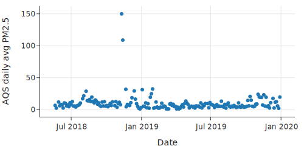
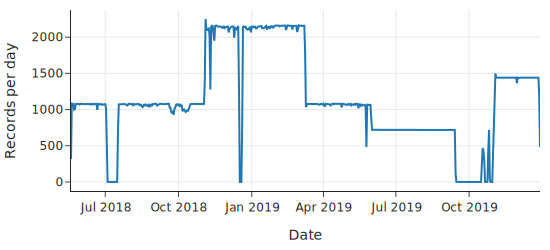
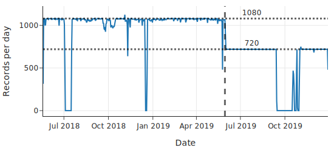
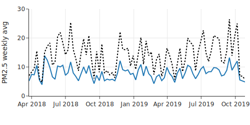
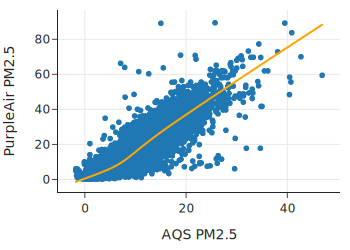

class: middle, center

## 案例研究

# 空气质量测量有多准确？

---
# 内容

- 问题、设计和范围
- 查找并置的传感器
- 整理和清理 AQS 传感器数据
- 整理 PurpleAir 传感器数据
- 探索 PurpleAir 和 AQS 测量
- 创建模型来校正 PurpleAir 测量结果

---
# 背景
- 环保局的空气质量检测仪，很贵、少、更新慢（小时级）
- 个人检测仪 补充
  - https://www2.purpleair.com/
 
---
# 数据科学生命周期
  - 考虑问题和可用数据的scope
  - 清理和整理数据
  - 探索性数据分析并构建泛化模型

---
# 考虑问题和可用数据的scope
- 配对 个人传感器 和 环保局检测仪
- 发现 它们测量结果 的关系

---
# 读入数据

      !ls -lLh data/list_of*

      aqs_sites_full = pd.read_csv
          ('data/list_of_aqs_sites.csv')

      aqs_sites_full.shape

      aqs_sites_full.columns

---
# 确定 Granularity

一个 site 一行，AQS_Site_ID 是 主键

      aqs_sites_full['AQS_Site_ID'].value_counts()
但 发现 它 有冗余

      dup_site = aqs_sites_full.query(
            "AQS_Site_ID == '19-163-0015'")
      some_cols = ['POC', 'Monitor_Start_Date',
             'Last_Sample_Date', 'Sample_Collection_Method']
      dup_site[some_cols]
发现 POC 列 可以 区分

---
# 去除冗余，选第一个设备

      def rollup_dup_sites(df):
          return (
              df.groupby('AQS_Site_ID')
              .first()
              .reset_index()
          )

      aqs_sites = (aqs_sites_full
                  .pipe(rollup_dup_sites))
      aqs_sites.shape

---
# 调整结构，只包括需要的列

      def cols_aqs(df):
          subset = df[['AQS_Site_ID', 
              'Latitude', 'Longitude']]
          subset.columns = ['site_id', 'lat', 'lon']
          return subset

      aqs_sites = (aqs_sites_full
             .pipe(rollup_dup_sites)
             .pipe(cols_aqs))

---
# 读入个人设备表，JSON 格式

    !head data/list_of_purpleair_sensors.json | cut -c 1-60

    import json

    with open('data/list_of_purpleair_sensors.json') as f:
        pa_json = json.load(f)

    list(pa_json.keys())
    ['version', 'fields', 'data', 'count']

    pa_sites_full = pd.DataFrame(
        pa_json['data'], columns=pa_json['fields'])

    pa_sites_full.head()

---
# 验证 ID 是 唯一的

      pa_sites_full['ID'].value_counts()[:3]
发现模式 是 descending 排序

---
# 内容

- 问题、设计和范围
- .red[查找并置的传感器]
- 整理和清理 AQS 传感器数据
- 整理 PurpleAir 传感器数据
- 探索 PurpleAir 和 AQS 测量
- 创建模型来校正 PurpleAir 测量结果

---
# 找相近的传感器
  
  sql 方便

      import sqlalchemy

      db = sqlalchemy.create_engine('sqlite://')

      aqs_sites.to_sql(name='aqs', con=db, index=False)
      pa_sites.to_sql(name='pa', con=db, index=False)

---
# 找相近的传感器（SQL）
      query = f'''
      SELECT
        aqs.site_id AS aqs_id,
        pa.id AS pa_id,
        pa.label AS pa_label,
        aqs.lat AS aqs_lat,
        aqs.lon AS aqs_lon,
        pa.lat AS pa_lat,
        pa.lon AS pa_lon
      FROM aqs JOIN pa
        ON  pa.lat - {offset_in_lat} <= aqs.lat
        AND aqs.lat <= pa.lat + {offset_in_lat}
        AND pa.lon - {offset_in_lon} <= aqs.lon
        AND aqs.lon <= pa.lon + {offset_in_lon}
      '''
      matched = pd.read_sql(query, db)

对齐 传感器 对

---
# 内容

- 问题、设计和范围
- 查找并置的传感器
- .red[整理和清理 AQS 传感器数据]
- 整理 PurpleAir 传感器数据
- 探索 PurpleAir 和 AQS 测量
- 创建模型来校正 PurpleAir 测量结果

---
# 质量检查
- 检查并纠正数据的粒度
- 删除不需要的列
- 检查 date_local 列中的值
- 检查算术平均值列中的值

---
# 检查并纠正数据的粒度
  
      aqs_full['date_local'].value_counts()
发现 有 12个值

看这 12个值的范围

      (aqs_full.groupby('date_local')['arithmetic_mean']
      .agg(np.ptp) # np.ptp computes max() - min()
      .value_counts()
      )
发现为 0。因此，选第一个就行。

---
# 检查并纠正数据的粒度

从 12 个 里，选第 1 个

      def rollup_dates(df):
          return (
              df.groupby('date_local')
              .first()
              .reset_index()
          )

---
# 转换时间类型

      def parse_dates(df):
          date_format = '%Y-%m-%d'
          timestamps = pd.to_datetime(df['date_local'], 
              format=date_format)
          return df.assign(date_local=timestamps)
检查 时间 范围

得到 Timedelta 对象

      date_range = aqs['date_local'].max() 
                    - aqs['date_local'].min()
      date_range.days

---
# 检查 PM2.5 质量

    px.scatter(aqs, x='date_local', y='pm25',
        labels={'date_local':'Date', 
              'pm25':'AQS daily avg PM2.5'},
        width=500, height=250)
.center[.width-80[]]
  高值，山火？

---
# 内容

- 问题、设计和范围
- 查找并置的传感器
- 整理和清理 AQS 传感器数据
- .red[整理 PurpleAir 传感器数据]
- 探索 PurpleAir 和 AQS 测量
- 创建模型来校正 PurpleAir 测量结果

---
# 转换时间

      from pathlib import Path

      data_folder = Path('data/purpleair_AMTS')
      pa_csvs = sorted(data_folder.glob('*.csv'))

      def parse_timestamps(df):
          date_format = '%Y-%m-%d %X %Z'
          times = pd.to_datetime(df['timestamp'], 
                  format=date_format)
          return (df.assign(timestamp=times)
                  .set_index('timestamp'))

      pa = (pa_full
            .pipe(drop_and_rename_cols)
            .pipe(parse_timestamps))

---
# 考虑时区

时区是 UTC 时区

用 pa.tz_convert 做 时区转换。作用于 index

      def convert_tz(pa):
          return pa.tz_convert('US/Pacific')

---
# 按天统计

用 resample 做 timestamp 的 group

      per_day = (pa.resample('D')
           .size()
           .rename('records_per_day')
           .to_frame()
      )

      px.line(per_day, x=per_day.index, y='records_per_day', 
          labels={'timestamp':'Date', 
                'records_per_day':'Records per day'},
          width=550, height=250,)

---
# 按天统计

- .center[.width-100[]]
    - 2 分钟一个，应该是 720 个
      - 这有 2000 多的
      - 也有 0
    - pa.loc['2019-01-01'].index.value_counts()
      - duplicate

---
# 去掉 多余的

      def drop_duplicate_rows(df):
          return df[~df.index.duplicated()]

---
# 加标签

      fig = px.line(per_day, x=per_day.index, 
              y='records_per_day',
              labels={'timestamp':'Date', 
                  'records_per_day':'Records per day'}, 
              width=550, height=250)

      fig.add_annotation(x='2019-07-24', y=1080,
              text="1080", showarrow=False, yshift=10)

      fig.add_hline(y=1080, line_width=3, 
              line_dash="dot", opacity=0.6)
      
      fig.add_vline(x="2019-05-30", line_width=3,
              line_dash="dash", opacity=0.6)

---
# 加标签

.center[.width-100[]]

---
# 处理 missing 值

      cutoff_date = pd.Timestamp('2019-05-30', 
                      tz='US/Pacific')

      def has_enough_readings(one_day):
          [n] = one_day
          date = one_day.name
          return (n >= needed_measurements_80s
                  if date <= cutoff_date
                  else n >= needed_measurements_120s)

      should_keep = per_day.apply
            (has_enough_readings, axis='columns')

---
# 计算每日平均

      def compute_daily_avgs(pa):
          should_keep = (pa.resample('D')['PM25cf1']
                        .size()
                        .to_frame()
                        .apply(has_enough_readings, 
                            axis='columns'))
          return (pa.resample('D')
                  .mean()
                  .loc[should_keep])

      pa = (pa_full
            .pipe(drop_and_rename_cols)
            .pipe(parse_timestamps)
            .pipe(convert_tz)
            .pipe(drop_duplicate_rows)
            .pipe(compute_daily_avgs))

---
# 总结
- 准备和清洗 数据 做了 大量 工作
  - 处理缺失的数据
  - 汇总每个仪器的读数
  - 对两个仪器的读数进行平均
  - 删除不一致的行

---
# 内容

- 问题、设计和范围
- 查找并置的传感器
- 整理和清理 AQS 传感器数据
- 整理 PurpleAir 传感器数据
- .red[探索 PurpleAir 和 AQS 测量]
- 创建模型来校正 PurpleAir 测量结果

---
# 探索性数据分析（EDA）
  
获得 模型 的 insight，特别是关系

读取数据

      csv_file = 'data/cleaned_purpleair_aqs/
                    Full24hrdataset.csv'
      usecols = ['Date', 'ID', 'region', 'PM25FM', 
              'PM25cf1', 'TempC', 'RH', 'Dewpoint']
    
      full_df = (pd.read_csv(csv_file, usecols=usecols, 
                parse_dates=['Date'])
              .dropna())
    
      full_df.columns = ['date', 'id', 'region', 'pm25aqs',
              'pm25pa', 'temp', 'rh', 'dew']

---
# 统计每周平均

    nc4 = full_df.loc[full_df['id'] =='NC4']

    ts_nc4 = (nc4.set_index('date')
        .resample('W')['pm25aqs', 'pm25pa']
        .mean()
        .reset_index()
    )

---
# 画图

    fig = px.line(ts_nc4, x='date', y='pm25aqs',
          labels={'date':'', 'pm25aqs':'PM2.5 weekly avg'},
          width=500, height=250)

    fig.add_trace(go.Scatter(x=ts_nc4['date'], 
          y=ts_nc4['pm25pa'],
          line=dict(color='black', dash='dot')))

    fig.update_yaxes(range=[0,30])
    fig.update_layout(showlegend=False)
    fig.show()

---
# 每周平均

.center[.width-100[]]

---
# 相关图

    px.scatter(full_df, x='pm25aqs', y='pm25pa', 
          trendline='lowess', 
          trendline_color_override="orange",
          labels={'pm25aqs':'AQS PM2.5', 
              'pm25pa':'PurpleAir PM2.5'},
          width=350, height=250)

---
# 相关图

.center[.width-80[]]

      np.corrcoef(full_df['pm25aqs'], full_df['pm25pa'])

---
# 内容

- 问题、设计和范围
- 查找并置的传感器
- 整理和清理 AQS 传感器数据
- 整理 PurpleAir 传感器数据
- 探索 PurpleAir 和 AQS 测量
- .red[创建模型来校正 PurpleAir 测量结果]

---
# 构建泛化模型

      from sklearn.linear_model import LinearRegression

      AQS, PA = full_df[['pm25aqs']], full_df['pm25pa']

      model = LinearRegression().fit(AQS, PA)
      m, b = model.coef_[0], model.intercept_

      print(f"True Air Quality Estimate 
          = {-b/m:.2} + {1/m:.2}PA") 

---
# 练习

textbook-mastercontent/ch/12

1-pa_collocated.ipynb
2-pa_cleaning_aqs.ipynb
3-pa_cleaning_purpleair.ipynb
4-pa_eda.ipynb
5-pa_modeling.ipynb

---
# 作业

6-pa_exercises.ipynb

