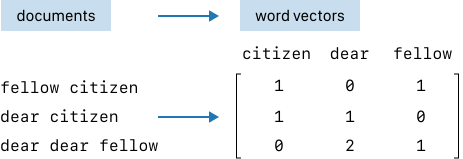
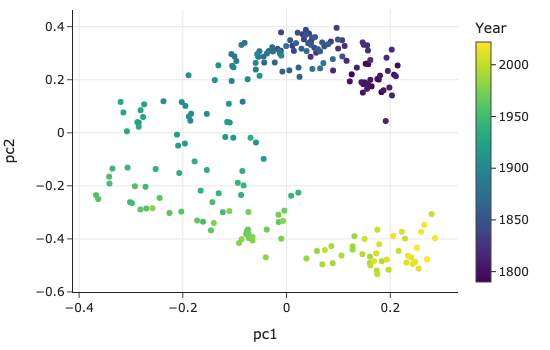

class: middle, center

# 处理文本

---
# 内容

- .red[字符串操作]
- 正则表达式
- 文本分析

---
# 文本处理

转小写、替换

      def clean_county(county):
          return (county
            .lower()
            .replace('county', '')
            .replace('parish', '')
            .replace('&', 'and')
            .replace('.', '')
            .replace(' ', ''))

---
# 文本处理

      election['County'] = (election['County']
          .str.lower()
          .str.replace('parish', '')
          .str.replace('county', '')
          .str.replace('&', 'and')
          .str.replace('.', '', regex=False)
          .str.replace(' ', ''))

      (log_entry.split('[')[1]
          .split(':')[0]
          .split('/'))

---
# 内容

- 字符串操作
- .red[正则表达式]
- 文本分析

---
# 正则表达式

      import re

      pattern = r'[ \[/:\]]'

      re.split(pattern, log_entry)[4:11]

---
# 字母 class
  - [012]
  - [0-2]
  - [0-2X-Z27]
  - \d

---
class: middle, center
# 任意字母
  .

---
class: middle, center
# 排除

  [^0-8]

---
class: middle, center
# 边界

  \b

---
# 数量

- {}
- {1,3}
- {1,}
- *
- +
- ?

---
# 例
      import re

      ssn_re = r'\b[0-9]{3}-[0-9]{2}-[0-9]{4}\b'
      re.findall(ssn_re, 'My SSN is 382-34-3840.')

      ssn_re_dot = r'[0-9].+[0-9]'
      re.findall(ssn_re_dot, 'My SSN is 382-34-3842
         and hers is 382-34-3333.')

---
# or

  ｜

      body_re = r"hand|nail|hair|glove"
      re.findall(body_re, "unclean hands or 
          improper use of gloves")

---
# 模式组

提取 模式 中的 部分，构成 模式 组

      time_re = r"\[([0-9]{2})/([a-zA-z]{3})/
            ([0-9]{4}):([0-9:\- ]*)\]"

      re.findall(time_re, log_entry)

---
class: middle, center
# end of line
  $ 

---
class: middle, center
# begining of line

  ^

---
# shorthands

- [a-zA-Z0-9_] \w
- [^a-zA-Z0-9_] \W
- [0-9] \d
- [^0-9] \D
- Whitespace [\t\n\f\r\p{Z}] \s
- Not whitespace [^\t\n\f\r\p{z}] \S

---
# re 模块
- search
- match
  - 开头
- findall
- sub
  - 代替
- split
- 可以用 编译 compile 加速

---
# pandas series str
- contains
- findall
- replace
- split

---
# 内容

- 字符串操作
- 正则表达式
- .red[文本分析]

---
# 文本分析示例

读入

      from pathlib import Path

      text = Path('data/stateoftheunion1790-2022.txt')
                .read_text()

---
# 找到数目

      import re
      num_speeches = len(re.findall(r"\*\*\*", text))
      print(f'There are {num_speeches} speeches total')

      records = text.split("***")

---
# 提取

      def extract_parts(speech):
          speech = speech.strip().split('\n')[1:]
          [name, date, *lines] = speech
          body = '\n'.join(lines).strip()
          return [name, date, body]

      def read_speeches():
          return pd.DataFrame(
            [extract_parts(l) for l in records[1:]], 
            columns = ["name", "date", "text"])

---
# 清洗
      def clean_text(df):
          bracket_re = re.compile(r'\[[^\]]+\]')
          not_a_word_re = re.compile(r'[^a-z\s]')
          cleaned = (df['text'].str.lower()
              .str.replace(bracket_re, '', regex=True)
              .str.replace(not_a_word_re, ' ', regex=True))
          return df.assign(text=cleaned)

      df = (read_speeches()
            .pipe(clean_text))

---
# 向量化

.center[.width-100[]]

---
# 向量化

      import nltk
      nltk.download('stopwords')
      nltk.download('punkt')

      from nltk.stem.porter import PorterStemmer
      from sklearn.feature_extraction.text 
              import TfidfVectorizer

      stop_words = set(nltk.corpus.stopwords.words('english'))
      porter_stemmer = PorterStemmer()

      def stemming_tokenizer(document):
          return [porter_stemmer.stem(word)
                  for word in nltk.word_tokenize(document)
                  if word not in stop_words]

      tfidf = TfidfVectorizer(tokenizer=stemming_tokenizer)
      speech_vectors = tfidf.fit_transform(df['text'])

---
# PCA

      from scipy.sparse.linalg import svds

      def compute_pcs(data, k):
          centered = data - data.mean(axis=0)
          U, s, Vt = svds(centered, k=k)
          return U @ np.diag(s)

      # Setting the random seed doesn't affect svds(), 
      # so re-running this code might flip the points 
      # along the x or y-axes.
      pcs = compute_pcs(speech_vectors, k=2)

      # hack: make sure the first row's PCs are both positive 
      # to get the same plot each time.
      if pcs[0, 0] < 0:
          pcs[:, 0] *= -1
      if pcs[0, 1] < 0:
          pcs[:, 1] *= -1

---
# PCA 后 画图
      with_pcs1 = df.assign(year=df['date'].
            str[-4:].astype(int), 
            pc1=pcs[:, 0], pc2=pcs[:, 1])

      fig = px.scatter(with_pcs1, x='pc1', 
            y='pc2', color='year',
            hover_data=['name'],
            width=550, height=350)

      fig.update_layout(coloraxis_colorbar_thickness=15,
                  coloraxis_colorbar_title='Year')
      fig.write_image('figures/sotu_pca.png')

---
# PCA 后画图

.center[.width-100[]]

---
# 总结
- 字符串操作、正则表达式和文档分析。
- 不建议使用正则表达式
  - 解析 JSON 或 HTML 等层次结构；请改用解析器。
  - 搜索复杂的属性，例如回文和平衡括号。
  - 验证复杂的功能，例如有效的电子邮件地址。
- 正则表达式缺点：计算复杂

---
# 练习

textbook-mastercontent/ch/12

1-text_strings.ipynb
2-text_regex.ipynb
3-text_sotu.ipynb

---
# 作业

4-text_exercises.ipynb