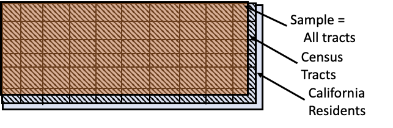
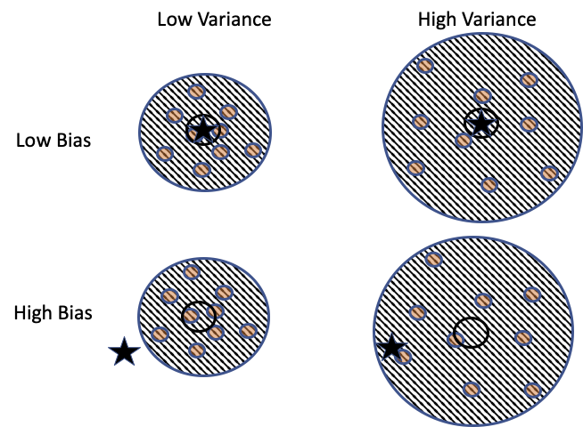

class: middle, center

# 数据范围和质量

---
# 内容

- .red[背景]
- 数据范围
- 测量方法
- 数据质量

---
class: middle, center
# 各种公开、网络数据集的出现

.center[.width-100[]]

谷歌流感预测：Google Flu Trends (GFT) ，搜索流感的关键词，能够改进 疾控中心 的数据 的 预测

---
# 问题

- 这些数据能拿过来就用吗？
- 不能
  - 数据可能和我们要研究的问题不匹配
  - 数据的测量方法有问题
  - 数据中有错误

---
# 问三方面的问题

- Who & Why
- When & Where
- How

---
# 内容

- 背景
- .red[数据范围]
- 测量方法
- 数据质量

---
# 数据来源
- 用户调查
  - 贵，难获得
- 互联网在线数据
  - 便宜，容易获得

---
# 数据范围（Scope）
- 目标人群（Target）
- 访问人群（Access Frame）
  - 可以接入，进行测量和观察的人群
  - 样本（Sample）来自这些人群
  - 和测量的时间、地点、方法有关

---
class: middle, center
# 例1：网络用户激励实验
.center[.width-100[]]

问题：给用户奖励，能不能提高用户贡献度

访问人群，需排除掉已得奖的人

---
class: middle, center
# 例2：选举胜选人调查

.center[.width-100[]]

访问人群中，有不是选民的人

---
class: middle, center
# 例3：环境对健康的影响

.center[.width-100[]]

访问人群：以社区网格为单位，不能区分个人

基于这个数据，只能回答“平均”的关系

---
# 例4: 自然科学实验

- 访问人群，和测量方法有关
  - 数据测量的点位
  - 仪器的数据质量
  - 测量样本的情况，比如多少

---
# 内容

- 背景
- 数据范围
- .red[测量方法]
- 数据质量

---
# 测量方法（Protocol）
- 调查问卷
  - 如何选择样本
  - 如何跟进没有回复的人
  - 调查员培训
  - 保护可信度
- 测量
  - 仪器
  - 方法

---
# 测量方法
- 实验
  - 控制变量，任何影响实验输出的因素都要控制住
    - 温度
    - Time of day（ToD）
    - 顺序
- 改变的环境
  - 系统运行中把算法改了
- 合并多个数据源的数据时要小心

---
# 示例：测量空气二氧化碳浓度，理解全球变暖

- ppm（parts per million）
  - 每 1M 干空气的 分子 中 二氧化碳 分子的 数量  

???
实验设计
- 设计
  - 控制变量，测量方案
  - 仪器使用
- 讨论
  - .red[你能想到哪些控制变量、测量方案？]
  - .red[你能想到如何使用仪器，使测量更准确？]

---
# 控制变量
- 地点
- 时间：Time of day
- 植物
- 海拔
- 污染

---
# 地点
- 太平洋上的一个火山口
- 远离污染源
- 足够高
- 周围是岩浆，没有植被

---
# 仪器使用
- 用不同种类设备，在火山口周期测量
- 把样本送到实验室，精细测量
- 设备校准
  - 每小时，对1个已知浓度的参考气体，测量5分钟
  - 每天，对另外2个已知浓度的参考气体，测量15分钟
- 虽然 相对 稳定，但是，如果偏离了 小时平均，就 每 5 分钟测量平均浓度

---
# 内容

- 背景
- 数据范围
- 测量方法
- .red[数据质量]

---
# 数据质量

- 仪器准确度
- 缺失值，异常值
- 测量误差：是否有偏差，精度如何

---
class: middle, center
# 仪器准确度
.center[.width-100[]]

测量的访问人群分布，就像一个飞镖板

???
仪器准确度
- 真值：小时平均
- 测量：每5分钟平均
- 结果：偏差 0.3 ppm
- 就像一个 飞镖板

---
# 测量误差
- 两部分
  - Bias：偏差，偏了多少?
  - Precision：精度（variation），分布多广?
- 和仪器、测量方法有关

---
class: middle, center
# Bias 和 Precision
.center[.width-70[]]

不同的偏差（bias） 和精度（precision、variation）

思考：增加样本数，能够应对 bias 还是 variation？

---
# 产生 Bias 的原因
- 覆盖偏差
  - 电话调研，忽略了那些没有电话的人
- 选择偏差
  - 选择那些容易访问的人
  - 志愿者

---
# 产生 Bias 的原因
- 不响应的偏差
  - 不接电话
  - 接了，但不回答一些问题
- 测量偏差
  - 低湿 会 让 空气污染 测量 的结果 不正确的 高
  - 测量仪器会 漂移
  - 问题有歧义，或者故意向特定方向 引导回答，或者 让人 不能诚实地回答

---
# 设计调查方法，减少偏差
- 设计调查方法（protocol），减少 bias
- 随机受控实验
- 不响应的人，有一个 follow up 方法
- 先做一个 预调研 （pilot survey），改进问题的提法
- 调试仪器

---
# 案例
- 2016 总统选举
- 几乎所有民调都预测克林顿赢
- 大学教育的人多，因为他们更愿意接受民调，而他们支持克林顿
  - 选择偏差
- 投票前几天，大家改主意了
  - 调查是静精度（precision）的

---
# 精度（Variation）
- 随机 选择样本（Chance 机制）
- 分组，调查 3 次，每次选的 100 人不同
- 使用经过良好校准的仪器进行测量

---
# 小结

- 背景
- 数据范围
- 测量方法
- 数据质量

---
# 小结

- 在用一个数据之前，总是问自己以下问题：
  - 谁收集了这个数据？（Who）
  - 他们为什么收集这个数据？（Why）
- 以决定这个数据是否适用于解决你感兴趣的问题

---
# 总是问自己
- 数据范围（Scope）
  - 数据何时收集的（When）
  - 在哪里被收集的（Where）
- 以决定你的发现是不是和你感兴趣的研究场景相关

---
# 总是问自己
- 目标人群和测量方法
  - 目标人群（或未知参数的值）是多少？
  - 目标人群是如何访问到的？
  - 使用什么方法来选择样本/进行测量？
  - 使用了哪些仪器，如何校准它们？
- 以决定你是否能够信任你的发现，能不能推广这些发现
