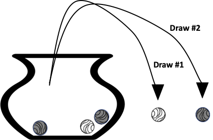
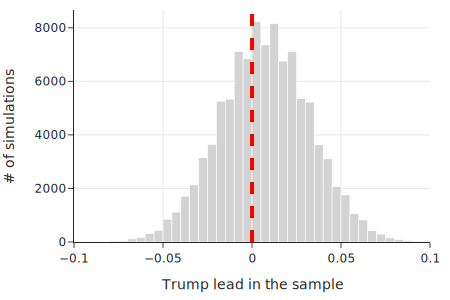
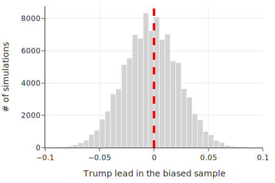
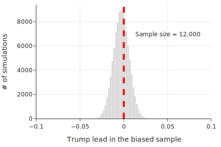

class: middle, center

# 抽样方法

---
# 内容

- .red[随机抽样的 Urn 模型]
- 民调方法偏差的影响

---
# 抽样

- 目标人群（Population）
- 测量人群
  - 抽样
  - 样本（Sample）

---
# 随机抽样的 Urn 模型

Jacob Bernoulli 1700 早期提出，模型从一个人群中选择样本

.center[.width-50[]]

- 两种抽样方式
  - 不放回（without replacement）
  - 有放回（with replacement）

---
# AI 编程

https://www.marscode.cn/

注册，登录

新建 Python 项目

修改 main.py

print("Hello, World!")

Run

---
# AI 代码解释

打开 AI 助手

选中一句代码，选择 “Explain”

如果看不懂，就说：

- 你的解释太复杂。我是一位高中生，从来没有编过程序。请不要用技术术语，而要用高中生能够理解的话解释。回答要简洁。对抽象的技术概念，就用生活中的例子来类比说明，

---
# AI 代码生成

- 生成
  - 生成一个 Urn 抽样的仿真代码
- 简化
  - 这段代码太复杂，我是一个 Python 的小白，请简化代码，不要用函数
- Insert
- Run

---
# Urn 抽样仿真代码

不放回

      import numpy as np

      urn = ["b", "b", "b", "w", "w"]

      print("Sample 1:", np.random.choice(urn, size=2,
              replace=False))

      print("Sample 2:", np.random.choice(urn, size=2,
              replace=False))

      Sample 1: ['b' 'w']
      Sample 2: ['w' 'b']

---
# 编程练习：重复多次

      import numpy as np

      urn = ["b", "b", "b", "w", "w"]

      n = 3

      samples = [np.random.choice(urn, size=2, 
                  replace=False) for _ in range(n)]

      print(samples)

---
# 编程练习：统计匹配概率

      is_matching = [marble1 == marble2 
            for marble1, marble2 in samples]
      print(is_matching)

      print(f"Proportion of matching: 
            {np.mean(is_matching)}")

---
# 仿真 1 万次

      n = 10_000

      samples = [np.random.choice(urn, size=2, 
          replace=False) for _ in range(n)]

      is_matching = [marble1 == marble2 for marble1, 
          marble2 in samples]

      print(f"Proportion of samples with matching 
          marbles: {np.mean(is_matching)}")

      Proportion of samples with matching marbles: 0.4032

---
class: middle, center
# 排列组合

---
# combinations 产生所有组合

      from itertools import combinations

      all_samples = ["".join(sample) for sample in 
          combinations("ABCDEFG", 3)]

      print(all_samples)

      ['ABC', 'ABD', 'ABE', 'ABF', 'ABG', 'ACD', 
      'ACE', 'ACF', 'ACG', 'ADE', 'ADF', 'ADG', 'AEF', 
      'AEG', 'AFG', 'BCD', 'BCE', 'BCF', 'BCG', 'BDE', 
      'BDF', 'BDG', 'BEF', 'BEG', 'BFG', 'CDE', 'CDF', 
      'CDG', 'CEF', 'CEG', 'CFG', 'DEF', 'DEG', 'DFG', 
      'EFG']

---
# permuatation 产生所有排列

      from itertools import permutations

      print(["".join(sample) for sample in 
        permutations("ABC")])

      ['ABC', 'ACB', 'BAC', 'BCA', 'CAB', 'CBA']

---
class: middle, center
# 常用抽样方法

---
# 常用抽样方法
- 分层抽样（Stratified sampling）
  - 分成不重叠的人群：按年龄分
  - 在每一个人群中简单抽样
- 聚类抽样（Cluster sampling）
  - 分成不重叠的簇
  - 随机选取一个簇

???
统计：均值

      urn = [1, 1, 0, 1, 0, 1, 0]
      sample = np.random.choice(urn, size=3, replace=False)

      print(f"Sample: {sample}")
      print(f"Prop Failures: {sample.mean()}")

      Sample: [1 0 0]
      Prop Failures: 0.3333333333333333

重复 1万次

      samples = [np.random.choice(urn, size=3, 
          replace=False) for _ in range(10_000)]

      prop_failures = [s.mean() for s in samples]

      unique_els, counts_els = np.unique(
          prop_failures, return_counts=True)

      pd.DataFrame({
          "Proportion of failures": unique_els,
          "Fraction of samples": counts_els / 10_000,})

结果

      Proportion of Failures	Fraction of Samples
      0	  0.00	  0.03
      1	  0.33	  0.35
      2	  0.67	  0.51
      3	  1.00	  0.11

---
# 有放回抽样

- 二项（binomial）分布

---
# 无放回抽样

超几何分布（hypergeometric distribution）

numpy 的 random.hypergeometric 函数实现

      simulations_fast = np.random.hypergeometric(
          ngood=4, nbad=3, nsample=3, size=10_000
      )

      print(simulations_fast)

      [1 1 2 ... 1 2 2]

???
      unique_els, counts_els = np.unique(simulations_fast, 
        return_counts=True)

      pd.DataFrame({
          "Number of failures": unique_els,
          "Fraction of samples": counts_els / 10_000,})

      Number of Failures	Fraction of Samples
      0	0	0.03
      1	1	0.34
      2	2	0.52
      3	3	0.11

超几何分布

scipy stats 的 hypergeom 函数实现

      from scipy.stats import hypergeom

      num_failures = [0, 1, 2, 3]

      pd.DataFrame({
          "Number of failures": num_failures,
          "Fraction of samples": hypergeom.pmf
          (num_failures, 7, 4, 3),})

      Number of Failures	Fraction of Samples
      0	0	0.03
      1	1	0.34
      2	2	0.51
      3	3	0.11

---
# 内容

- 随机抽样的 Urn 模型
- .red[民调方法偏差的影响]

---
# 民调的难题

- 2016年美国总统选举
- 几乎所有民调都预测克林顿赢
- 但实际上输了？为什么？

---
class: middle, center
# 民调方法偏差

---
# 专家事后分析

- 投票前和后，平均偏差 1.5%
- 如果两人本来就相差不大，这个偏差带来的影响就很大
- 选择偏差
  - 大学教育的人更愿意接受民调，而他们支持克林顿
- 当然，也有 Variation 的问题
  - 投票前几天，大家改主意了
  - 调查是静精度（precision）的

---
# 产生偏差的原因
- 覆盖偏差
  - 电话调研，忽略了那些没有电话，或者不接电话的人
  - 川普的支持者，不接电话
- 选择偏差
  - 选择那些容易访问的人
  - 志愿者

---
# 产生偏差的原因
- 不响应的偏差
  - 不接电话
  - 接了，但不回答一些问题
- 测量偏差
  - 低湿 会 让 空气污染 测量 的结果 不正确的 高
  - 测量仪器会 漂移
  - 问题有歧义，或者故意向特定方向 引导回答，或者 让人 不能诚实地回答

---
class: middle, center
# 仿真验证偏差的影响

仿真 6M 人中 抽样 1.5K 人

---
# 三种不同态度的人

第一种人，比第二种人 多 0.4818 – 0.4746 = 0.0072

      N = 6_165_478

      proportions = np.array([0.4818, 0.4746,
          1 - (0.4818 + 0.4746)])

      votes = np.trunc(N * proportions).astype(int)

      array([2970527, 2926135, 268814])

---
# 无放回抽样

1.5K 抽样人中，三种人的多变量超几何分布

      from scipy.stats import multivariate_hypergeom

      n = 1_500

      votes = array([2970527, 2926135, 268814])

      multivariate_hypergeom.rvs(votes, n)

      array([727, 703, 70])

---
# 无放回抽样

      multivariate_hypergeom.rvs(votes, n)

      array([711, 721,  68])

每次的抽样结果都不同

---
# 仿真 1 万次

      def trump_advantage(votes, n):

          sample_votes = multivariate_hypergeom
                .rvs(votes, n)
          return (sample_votes[0] - sample_votes[1]) / n

      simulations = [trump\_advantage(votes, n) 
          for _ in range(100_000)] 

      np.mean(simulations)

      0.007177066666666666
平均起来，第一种人，比第二种人 多 0.4818 – 0.4746 = 0.0072，是对的

---
# 仿真结果

.center[.width-100[]]

第一种人多的比例的直方图：很多次抽样中第二种人多

---
# 仿真结果

      np.mean(np.array(simulations) > 0)

      0.60613

1 万次里，60% 是第一种人多，但另外的 40% 中，第二种人多

---
# 加一点 bias

偏差：偏向 第二种人 0.005

      bias = 0.005
      proportions_bias = np.array([0.4818 - bias, 
          0.4747 + bias, 1 - (0.4818 + 0.4746)])

      array([0.48, 0.48, 0.04])

      np.mean(np.array(simulations_bias) > 0) 

0.44967

---
# 仿真结果
.center[.width-100[]]

.red[第二种人多的情况就多了]

---
# 增加仿真次数

.center[.width-80[]]

效果差不多

.red[增加次数，不改善 Bias]

---
class: middle, center
# 解决办法

---
# 设计调查方法，减少偏差
- 随机受控实验
- 预调研，发现偏差，然后改进
- 减少覆盖偏差
  - 不响应的人，有一个 follow up 方法
- 调试仪器

---
# 小结

- Urn 模型
- 民意调查偏差和精度
  - Variation，Bias

---
# 课堂练习

- 随机抽样
  - 你心仪职位的职责中，有没有需要做随机抽样的？请举例说明
  - 你做这个抽样的时候，是做有放回抽样，还是不放回抽样？
- 民调
  - 你心仪职位的职责中，有没有需要做民调的？请举一个例子，然后分析可能会产生偏差的原因，最后设计调查方法，减少偏差

???

代码

https://github.com/DS-100/textbook/tree/master/content/ch/03

课上演示
- theory_urn.ipynb
- theory_sampling_variation.ipynb
- theory_election.ipynb
- theory_random_assignment.ipynb
- theory_measurement_error.ipynb

作业
theory_exercises.ipynb
- Cluster Sampling
- Systematic Sampling
- Intercept Survey sampling
- 囚犯回归悖论

ds100 lec9，note9
      sampling 收集 数据