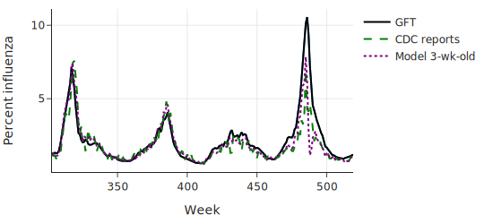
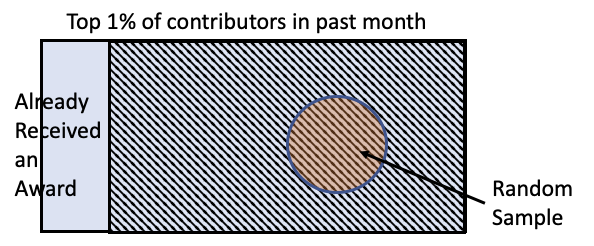
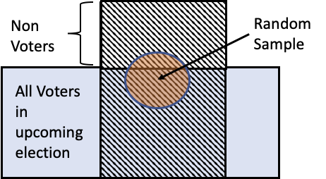
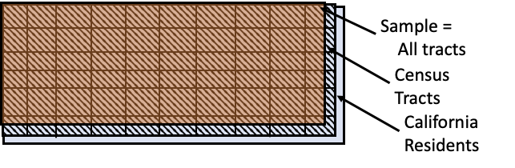
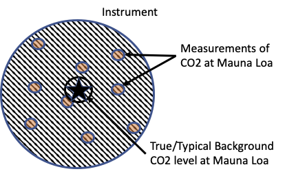
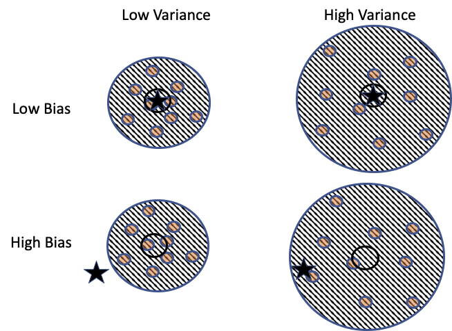
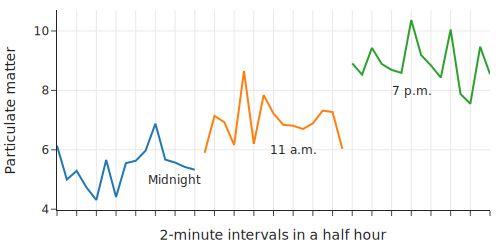
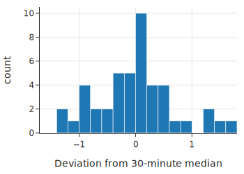

class: middle, center

# 数据范围和质量

---
# 内容

- .red[背景]
- 数据范围
- 测量方法
- 数据质量
- 不同方案的比较

---
# 数据有各种来源

- 公开数据集
  - 便宜，容易获得
- 现有企业内部数据
  - 杂乱，分散在各处，质量堪忧
- 新增测量数据
  - 用户调查
  - 贵，成本高

---
class: middle, center
# 企业内部数据

.center[.width-100[]]

谷歌流感预测：Google Flu Trends (GFT) ，搜索流感的关键词，能够改进疾控中心的疾病流行度预测

---
# 现有数据集的问题

- 现有数据能拿过来就用吗？
- 不一定
  - 数据可能和我们要研究的问题不匹配
  - 数据的测量方法有问题
  - 数据中有错误

---
# 内容

- 背景
- .red[数据范围]
- 测量方法
- 数据质量
- 不同方案的比较

---
# 数据范围（Scope）
- 目标人群（Target）
  - 研究对象：系统、人、组织、产品、行业
- 测量人群（Access Frame）
  - 可以接入，进行测量和观察的人群
  - 样本（Sample）来自这些人群
  - 和测量的时间、地点、方法有关
- 两者需要匹配

---
class: middle, center
# 例1：网络用户激励实验

问题：给用户奖励，能不能提高用户贡献度？

做一个实验

实验的目标人群是？

---
class: middle, center
# 例1：测量人群

.center[.width-100[]]

测量人群中包括了已得奖的人

这些人不应该参与实验，不属于目标人群

---
class: middle, center
# 例2：选举民调

调查哪些人，能够预测选举结果？

目标人群：会投票的人

---
class: middle, center
# 例2：测量人群

.center[.width-100[]]

测量人群中，可能有不投票的人，不匹配

---
class: middle, center
# 例3：环境对健康的影响

目标人群：个人

---
class: middle, center
# 例3：测量人群

.center[.width-100[]]

因为调查是以社区网格为单位，不能区分个人

测量人群只能到“小区级”，只能回答“平均”的关系

---
# 例4: 科学实验

- 测量人群和测量方法有关
  - 测量的点位
  - 仪器质量
  - 测量样本的情况，比如多少

---
# 内容

- 背景
- 数据范围
- .red[测量方法]
- 数据质量

---
class: middle, center
# 测量方法

设计测量方法，确保测量人群和目标人群的匹配

---
# 测量方法（Protocol）
- 系统运维数据
  - 如何记录指标时间序列、日志、Trace 信息
- 调查问卷
  - 如何选择样本
  - 如何跟进没有回复的人
  - 调查员培训
  - 保护可信度
- 测量仪器
  - 调试和使用方法

---
# 测量时注意
- 控制变量
  - 任何影响实验输出的因素都要控制住
  - 温度
  - 时间：Time of day（ToD）
  - 顺序
- 环境变化
  - 系统运行中把算法改了
- 合并多个数据源的数据时要小心

---
class: middle, center
# 示例：测量空气二氧化碳浓度

## 理解全球变暖

ppm（parts per million）

每 1M 干空气的 分子 中 二氧化碳 分子的 数量  

???
实验设计
- 设计
  - 控制变量，测量方案
  - 仪器使用
- 讨论
  - .red[你能想到哪些控制变量、测量方案？]
  - .red[你能想到如何使用仪器，使测量更准确？]

---
# 控制变量
- 地点
- 时间：Time of day
- 植物
- 海拔
- 污染

---
# 地点选择
- 太平洋上的一个火山口
- 远离污染源
- 足够高
- 周围是岩浆，没有植被

---
# 仪器使用
- 用不同种类设备，在火山口周期测量
- 把样本送到实验室，精细测量
- 设备校准
  - 每小时，对1个已知浓度的参考气体，测量5分钟
  - 每天，对另外2个已知浓度的参考气体，测量15分钟
- 虽然相对稳定，但是，如果偏离了小时平均，就每 5 分钟测量平均浓度

---
# 内容

- 背景
- 数据范围
- 测量方法
- .red[数据质量]
- 不同方案的比较

---
# 数据质量

- 测量误差
  - 偏差
  - 精度
- 缺失，异常

---
class: middle, center
# 测量误差
.center[.width-100[]]

就像一个飞镖板

???
仪器准确度
- 真值：小时平均
- 测量：每5分钟平均
- 结果：偏差 0.3 ppm
- 就像一个 飞镖板

---
# 测量误差
- 两部分
  - 偏差（Bias）
  - 精度（Precision，Variation）：分布，变化
- 和仪器、测量方法有关

---
class: middle, center
# 偏差和精度
.center[.width-80[]]

思考：增加样本数，能够应对偏差还是精度？

---
# 提高精度的方法
- 随机选择样本（Chance 机制）
- 分组，调查 3 次，每次选的 100 人不同
- 使用经过良好校准的仪器进行测量

---
# 例：空气质量测量仪的精度
- 大家买空气质量检测仪
  - 这些数据上传到网上，形成地图
  - 数据可以下载
- 这些检测仪的测量结果的精度怎么样？

---
# 一个传感器的数据
.center[.width-100[]]

- 两分钟平均
- pm2.5， 每立方米的“微克”

---
# 与 30 分钟中值的变化程度
.center[.width-80[]]

经常比 0.5 小，很少大于 1

---
# 变化程度
- 标准差 
  - np.std(pm['diff30'])
  - 0.687
- 相对标准差
  - 标准差/均值
  - 8% - 12%
- 还是比较精确的

---
# 内容

- 背景
- 数据范围
- 测量方法
- 数据质量
- .red[不同方案的比较]

---
class: middle, center
# 不同方案的比较

必须在同样的数据范围下

---
# 比较疫苗有效性
- 市长说，疫苗 A 有效性 65%，不好，要换 95% 的疫苗 B
- 问题
  - 疫苗能够比较吗？
  - 数据范围一样吗？
- 三个经典问题
  - 谁收集了这个数据？（Who）
  - 数据何时收集的（When）
  - 在哪里被收集的（Where）

---
# 数据范围
- 疫苗A
  - 18岁及以上成年人，40% 患有与患严重 COVID-19 风险增加相关的既往疾病
  - 2020年10月至11月
  - 三大洲八个国家，包括美国和南非
- 疫苗B
  - 主要是美国
  - 40% 有既往病史
  - 2020 年夏季早期

---
# 结论
- 试验时间和地点使它们难以比较
  - 美国 COVID-19 病例在夏季处于低点，但在秋末迅速上升
  - 在疫苗A试验期间，一种传染性更强的病毒变种正在南非迅速传播
- 市长最终接受了这个解释

---
class: middle, center
# 数据范围的检查清单

在用一个数据之前，总是问自己以下问题

---
# 数据来源

- 谁收集了这个数据？（Who）
- 他们为什么收集这个数据？（Why）
- 以决定这个数据是否适用于解决你感兴趣的问题

---
# 数据收集
- 数据何时收集的（When）
- 在哪里被收集的（Where）
- 以决定你的发现是不是和你感兴趣的研究场景相关

---
# 目标人群和测量方法
- 目标人群（或未知参数的值）是多少？
- 目标人群是如何访问到的？
- 使用什么方法来选择样本/进行测量？
- 使用了哪些仪器，如何校准它们？
- 以决定你是否能够信任你的发现，能不能推广这些发现

---
# 课堂练习

- 你心仪的职位，面向的目标人群是？
- 在该职位所在公司里，可能有什么目标人群数据？
- 在用这个数据之前，问自己以下问题
  - 谁会收集这些数据？为什么收集这些数据？
  - 这些数据和你要研究的目标人群，是否匹配？
  - 这些数据会在何时、何地收集？用什么方法？这些方法可能有什么问题？
  - 这些数据可能会有什么偏差、精度方面的问题？如何解决？

---
# 课堂练习

- 你心仪职位的职责中，可能有什么需要对两个方案进行比较？
- 可能让它们难以比较的原因

---
# 公共数据集

