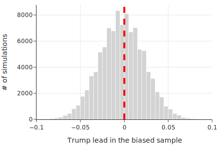
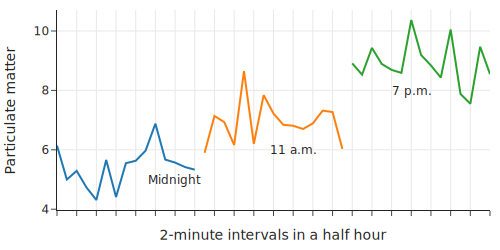
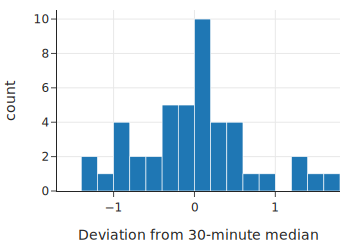

class: middle, center

# 仿真与数据设计

---
# 内容

- Urn 模型
- 示例1：仿真民意调查偏差和精度
- 示例2：疫苗有效性
- 示例3：测量空气质量

---
# 内容

- .red[Urn 模型]
- 示例：仿真民意调查偏差和精度
- 示例：疫苗有效性
- 示例：测量空气质量

---
# Urn 模型

Jacob Bernoulli 1700 早期 提出，模型 从一个 人群中 选择 样本

.center[.width-50[]]

- 两种采样方式
  - 放回（with replacement）
  - 不放回（without replacement）

---
# Urn 采样仿真代码

      import numpy as np

      urn = ["b", "b", "b", "w", "w"]

      print("Sample 1:", np.random.choice(urn, size=2,
              replace=False))

      print("Sample 2:", np.random.choice(urn, size=2,
              replace=False))

      Sample 1: ['b' 'w']
      Sample 2: ['w' 'b']

---
# 仿真 1 万次

      n = 10_000

      samples = [np.random.choice(urn, size=2, 
          replace=False) for _ in range(n)]

      is_matching = [marble1 == marble2 for marble1, 
          marble2 in samples]

      print(f"Proportion of samples with matching 
          marbles: {np.mean(is_matching)}")

      Proportion of samples with matching marbles: 0.4032

---
# combinations 产生所有组合

      from itertools import combinations

      all_samples = ["".join(sample) for sample in 
          combinations("ABCDEFG", 3)]

      print(all_samples)

      ['ABC', 'ABD', 'ABE', 'ABF', 'ABG', 'ACD', 
      'ACE', 'ACF', 'ACG', 'ADE', 'ADF', 'ADG', 'AEF', 
      'AEG', 'AFG', 'BCD', 'BCE', 'BCF', 'BCG', 'BDE', 
      'BDF', 'BDG', 'BEF', 'BEG', 'BFG', 'CDE', 'CDF', 
      'CDG', 'CEF', 'CEG', 'CFG', 'DEF', 'DEG', 'DFG', 
      'EFG']

---
# permuatation 产生所有排列

      from itertools import permutations

      print(["".join(sample) for sample in 
        permutations("ABC")])

      ['ABC', 'ACB', 'BAC', 'BCA', 'CAB', 'CBA']

---
# 思考

放回（with replacement），不放回（without replacement），最后得到的样本的区别是？

---
# 常用方法
- 分层抽样（Stratified sampling）
  - 分成 不重叠 的 层：strata （复数） stratum （单数）
  - 每一层 中 简单抽样
- Cluster sampling
  - 分成 不重叠的 簇
  - 随机选取一个 簇

???
统计：均值

      urn = [1, 1, 0, 1, 0, 1, 0]
      sample = np.random.choice(urn, size=3, replace=False)

      print(f"Sample: {sample}")
      print(f"Prop Failures: {sample.mean()}")

      Sample: [1 0 0]
      Prop Failures: 0.3333333333333333

重复 1万次

      samples = [np.random.choice(urn, size=3, 
          replace=False) for _ in range(10_000)]

      prop_failures = [s.mean() for s in samples]

      unique_els, counts_els = np.unique(
          prop_failures, return_counts=True)

      pd.DataFrame({
          "Proportion of failures": unique_els,
          "Fraction of samples": counts_els / 10_000,})

结果

      Proportion of Failures	Fraction of Samples
      0	  0.00	  0.03
      1	  0.33	  0.35
      2	  0.67	  0.51
      3	  1.00	  0.11

---
# 无放回采样

hypergeometric distribution 超几何分布

numpy 的 random.hypergeometric 函数实现

      simulations_fast = np.random.hypergeometric(
          ngood=4, nbad=3, nsample=3, size=10_000
      )

      print(simulations_fast)

      [1 1 2 ... 1 2 2]

???
      unique_els, counts_els = np.unique(simulations_fast, 
        return_counts=True)

      pd.DataFrame({
          "Number of failures": unique_els,
          "Fraction of samples": counts_els / 10_000,})

      Number of Failures	Fraction of Samples
      0	0	0.03
      1	1	0.34
      2	2	0.52
      3	3	0.11

---
# 无放回采样的分布

      from scipy.stats import hypergeom

      num_failures = [0, 1, 2, 3]

      pd.DataFrame({
          "Number of failures": num_failures,
          "Fraction of samples": hypergeom.pmf
          (num_failures, 7, 4, 3),})

      Number of Failures	Fraction of Samples
      0	0	0.03
      1	1	0.34
      2	2	0.51
      3	3	0.11

---
# 有放回采样

- 二项（binomial）分布

---
# 内容

- Urn 模型
- .red[示例：仿真民意调查偏差和精度]
- 示例：疫苗有效性
- 示例：测量空气质量

---
# 仿真民调偏差和精度
- 民调希拉里赢，但实际上输了？为什么会错？
- 仿真 6M 人中 采样 1.5K 人

---
# 设定 6M 人中 三种人数

      proportions = np.array([0.4818, 0.4746, 
          1 - (0.4818 + 0.4746)])

      第一种人，比第二种人 多 0.4818 – 0.4746 = 0.0072

      N = 6_165_478

      votes = np.trunc(N * proportions).astype(int)

      array([2970527, 2926135,  268814])

---
# 无放回采样

1.5K 采样人 中 三种人 的 多变量超几何分布

      from scipy.stats import multivariate_hypergeom

      n = 1_500

      votes = array([2970527, 2926135,  268814])

      multivariate_hypergeom.rvs(votes, n)

      array([727, 703, 70])

---
# 采样的变化性（Variation）

每次的采样结果不同

      multivariate_hypergeom.rvs(votes, n)

      array([711, 721,  68])

---
# 仿真 1万次

      def trump_advantage(votes, n):

          sample_votes = multivariate_hypergeom
                .rvs(votes, n)
          return (sample_votes[0] - sample_votes[1]) / n

      simulations = [trump\_advantage(votes, n) 
          for _ in range(100_000)] 

      np.mean(simulations)

      0.007177066666666666
第一种人，比第二种人 多 0.4818 – 0.4746 = 0.0072，是对的。但在很多次仿真中，结果是反着的

---
# 结果分布

.center[.width-100[]]

川普支持率的直方图

---
# 川普胜出概率

      np.mean(np.array(simulations) > 0)

      0.60613

1 万次里，60% 是川普领先，结果正确

但 40%，结果错误

.red[这是没有 bias 的]

---
# 加 bias

偏差：偏向 克林顿 0.005

      bias = 0.005
      proportions_bias = np.array([0.4818 - bias, 
          0.4747 + bias, 1 - (0.4818 + 0.4746)])

      array([0.48, 0.48, 0.04])

      np.mean(np.array(simulations_bias) > 0) 

0.44967，意味着 1 万次里 44% 川普领先，结果正确

.red[原来就相差不多，加这一点bias，就翻过来了]

---
### bias 的影响
.center[.width-100[]]

.red[原来就相差不多，加这一点bias，就翻过来了]

---
# 增加仿真次数

.center[.width-80[]]

效果差不多

.red[增加样本数，不改善 Bias]

---
# 专家事后分析

- 比较投票前和后，发现平均 bias 1.5%
- 如果两人本来就相差不大，这个 bias 带来的影响就很大

---
# 小结

- Urn 仿真，揭示了随机抽样的 Variation 和 Bias 的影响
- 设计实验的时候，要注意

---
# 内容

- Urn 模型
- 示例：仿真民意调查偏差和精度
- .red[示例：疫苗有效性]
- 示例：测量空气质量

---
# 疫苗有效性
- 市长说，疫苗 A 有效性 65%，不好，要换 95% 的疫苗 B
- 问题
  - 疫苗能够比较吗？
  - Scope 一样吗？
- 三个经典问题
  - 谁收集了这个数据？（Who）
  - 数据何时收集的（When）
  - 在哪里被收集的（Where）

---
# Scope
- 疫苗A
  - 18岁及以上成年人，40% 患有与患严重 COVID-19 风险增加相关的既往疾病
  - 2020年10月至11月
  - 三大洲八个国家，包括美国和南非
- 疫苗B
  - 主要是美国
  - 40% 有既往病史
  - 2020 年夏季早期
  
---
# 难以比较
- 试验时间和地点使它们难以比较
  - 美国 COVID-19 病例在夏季处于低点，但在秋末迅速上升
  - 在疫苗A试验期间，一种传染性更强的病毒变种正在南非迅速传播
- 市长最终接受了这个解释
  
---
# 疫苗 A 效果的 Urn 模型分析
- 43,738 志愿者
- 随机分配，一半疫苗，一半安慰剂
- 28天后，468人得了新冠，117 疫苗，351 没疫苗
  
---
# Urn 模型

假设：疫苗无效， 得新冠，只是中了奖

仿真验证：50万次实验，一共 43,738个人，从中选一半 21869 人

      imulations_fast = np.random.hypergeometric
            (ngood=468, nbad=43270, 
            nsample=21869, size=500000)

---
# “病人”数目分布

- .center[.width-80[]]
  - 50万次实验中，每次实验中的“病人”数目的分布，没有少于 117 人的
  - 即只有在极少概率下，假设（疫苗无效）才成立
  - 所以，疫苗有效

---
# 小结

- 不能简单比较两个实验的结果，要关注它们的 Scope 是不是一样
- 仿真评估，假设检验，检验一个“假设的可能性”

---
# 内容

- Urn 模型
- 示例：仿真民意调查偏差和精度
- 示例：疫苗有效性
- .red[示例：测量空气质量]

---
# 空气质量测量
- 曾经，大家都买空气质量检测仪
  - 这些数据上传到网上，形成地图
  - 数据可以下载
- 这些检测仪的测量结果的 Variation 怎么样？
  
---
# 一个传感器的数据
.center[.width-100[]]

- pm2.5， 每立方米的“微克”
- 两分钟平均

---
# 与 30分钟中值 的 偏离程度
.center[.width-80[]]

经常比 0.5 小，很少大于 1

---
# 与 30分钟中值 的 偏离程度
- 标准差 
  - np.std(pm['diff30'])
  - 0.6870817156282193
- 相对标准差
  - 标准差/均值
  - 8% - 12%
- 还是比较准确的（Precision）

---
# 小结

- 评估测量设备的 Precision
- .red[Bias 怎么办？]

---
# Bias 怎么办？

- 用其它高标准的设备来比较
- 后面会讲

---
# 小结

- Urn 模型
  - 仿真实验，验证 当前的实验结果 是否 能够 证伪 一个 假设
- 三个示例
  - 示例：仿真民意调查偏差和精度
      - Variation，Bias
  - 示例：疫苗有效性
      - Scope，假设检验
  - 示例：空气质量测量
      - Variation

---
# 代码链接

https://github.com/DS-100/textbook/tree/master/content

ch/03

- theory_urn.ipynb
- theory_sampling_variation.ipynb
- theory_election.ipynb
- theory_random_assignment.ipynb
- theory_measurement_error.ipynb

---
# 作业

theory_exercises.ipynb

- Cluster Sampling
- Systematic Sampling
- Intercept Survey sampling
- 囚犯回归悖论