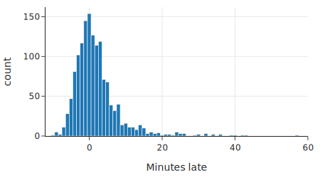
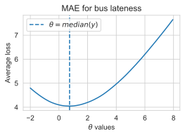
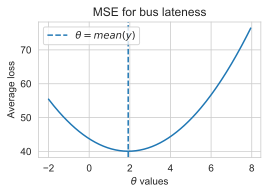

class: middle, center

# 使用汇总统计建模

---
# 内容

- 常数模型
- Loss 函数最小化

---
# 数据科学的生命周期
- 开始 分析，研究问题
- 探索性的数据分析
    - 这是关键
- 可视化，发现有趣的模式，趋势，总结数据
- 建模

---
# 建模过程

- 观察数据
- 提取 数据中 的 信息
  - Signal
  - 数据之间的关系
    - 湿度 和 空气质量
- 模型
  - 常数模型

---
# 案例：公交到达时间
- 数据
  - 计划到达时间：scheduled 
  - 实际到达时间：actual
  - 晚点时间：minutes_late

---
# 观察数据

晚点时间分布（直方图）

    times = pd.read_csv('data/seattle_bus_times_NC.csv')

    fig = px.histogram(times, x='minutes_late',
          width=450, height=250)

    fig.update_xaxes(range=[-12, 60],
          title_text='Minutes late')

---
class: middle, center
# 晚点时间分布（直方图）

.center[.width-100[]]
  
高点：0（mode）

---
# 观察数据

基本统计

      print(f"mean:    {times['minutes_late'].mean():.2f} 
          mins late")

      print(f"median:  {times['minutes_late'].median():.2f} 
          mins late")

      print(f"mode:    {0:.2f} mins late")

      mean:    1.92 mins late
      median:  0.74 mins late
      mode:    0.00 mins late

---
# 最简单的模型

- 常数模型
- mean，median，mode 选哪个数好？
  - 模型参数

---
# 内容

- 常数模型
- .red[Loss函数，最小化]

---
# Loss 函数
- 评估哪个模型好
- y 是真值，$\theta$ 是模型参数
- 找到让 loss 最小的 $\theta$

$L(\theta, \mathbf{y})$ = 
$\frac{1}{n}$ $\sum_{i = 1}^{N}$ $L(\theta, {y_i})$

---
# Mean Absolute Error （MAE）

$L(\theta, {\mathbf y})
= \frac{1}{n} \sum_{i = 1}^{n} |y_i - \theta|$

    def mae_loss(theta, y_vals):
        return np.mean(np.abs(y_vals - theta))

---
class: middle, center
# Trial and Error

实验，找到令 Loss 最小的模型参数

.center[.width-80[]]
  
以 MAE 为 loss 时，最佳的模型参数，是它的中值

---
# MSE

$L(\theta, {\mathbf y})$ = $\frac{1}{n} \sum_{i = 1}^{n} (y_i - \theta)^2$

    def mse_loss(theta, y_vals):
        return np.mean((y_vals - theta) ** 2)

---
class: middle, center
# 均值

.center[.width-80[]]

比 MAE 的增长得快！更高的loss

---
# 选择 loss 函数
- MSE 和 MAE，谁对 异常的 大值，更敏感？
- 讨论
  - 司机选择什么loss 函数？为什么？
  - 乘客选择什么loss 函数？为什么？
  - 你能提出什么更切实际的 loss 函数？

---
# 更多 Loss 函数
- 如果公交车到早了，会等待到发车时间再走呢？那么，早到 的 loss 应该怎么设？
- 如果超过三分钟，你就受不了，怎么设？

---
# 机器学习模型
- 选择模型
- 选择loss函数
- 最优化，找到loss最小的模型参数

---
# 小结

- 数据科学建模流程
  - 观察数据
  - 提出模型
  - 定义 Loss 函数
  - 优化模型，令 Loss 最小

---
# 代码链接

https://github.com/DS-100/textbook/tree/master/content

ch/04

modeling_simple.ipynb
modeling_loss_functions.ipynb

---
# 作业

modeling_exercises.ipynb

- Huber loss
- Trial and error 获得最佳模型
- 微积分推导 为什么 MSE minimal value 是 mean
- 理论推导 为什么 MAE 最小值是 median