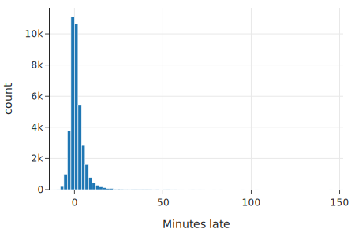
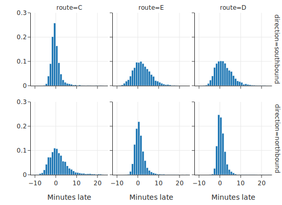
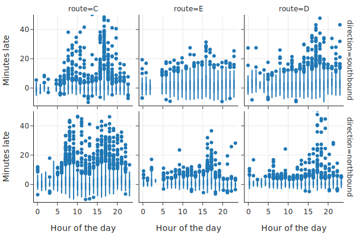
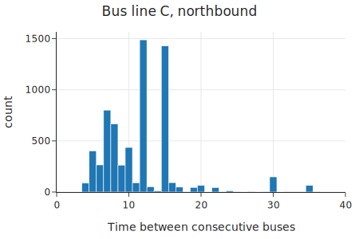
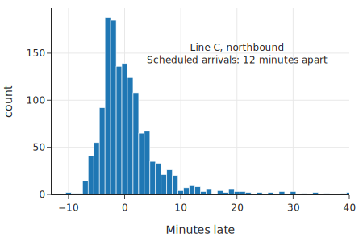
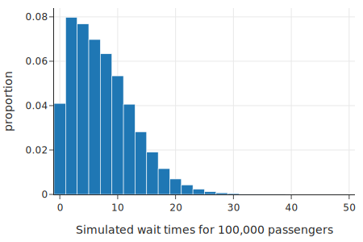

class: middle, center

# 案例研究：为什么我的公交车总是晚点？

---
# 内容

- 问题和数据
- 数据整理
- 探索数据
- 建模和仿真

---
# 案例
- 为什么我的公交车总是晚点？
  - 研究等待时间分布
  - fit 一个简单的模型， 用它的统计， 获得等待时间的分布
- 目的
  - 熟悉数据科学的基本过程
  - 学会如何思考问题、数据、模型

---
# 数据如何帮助我们理解世界？

- 如果公交车总是每隔10分钟到达的话，那么等待时间总是5分钟
  - 实际情况是？
- 研究过程
  - Refine 问题，使其可以 进行基于数据的研究
  - 考虑数据 Scope：是怎么收集的，可能的 bias
  - 准备数据，进行分析
  - 设计模型，仿真研究

---
# 步骤
- 第一步：问题，Scope
- 第二步：数据整理（ wrangling ）
- 第三步：数据探索
- 第四步：模型建立

---
# 第一步：确定问题，分析数据 Scope

- 问题：等待时间
- 数据：公交车到达时间数据

---
# 内容

- 问题和数据 Scope
- .red[数据整理]
- 数据探索
- 建模等待时间

---
# 第二步：数据整理

- 检查数据质量
- 简化数据结构
- 完成必要转换

---
# 读入数据

      bus = (pd.read_csv('data/seattle_bus_times.csv')
            .dropna(axis=0, how='any'))

      bus.head(3)
9 列

      OPD_DATE	VEHICLE_ID	RTE	DIR	...	
      STOP_ID	STOP_NAME	SCH_STOP_TM	ACT_STOP_TM

发现：有些列，好像是多余的

---
# 统计一列中的内容分布

站点ID、站点名

      bus[['STOP_ID','STOP_NAME']].value_counts()

      STOP_ID  STOP_NAME
      578      3RD AVE & PIKE ST (578)    19599
      431      3RD AVE & PIKE ST (431)    19318

      dtype: int64

---
# 统计一列中的内容分布

方向、站点ID、站点名

      bus[['DIR','STOP_ID','STOP_NAME']].value_counts()

      DIR  STOP_ID  STOP_NAME
      N    578      3RD AVE & PIKE ST (578)    19599
      S    431      3RD AVE & PIKE ST (431)    19318

      dtype: int64

---
# 翻译 路线和方向，更好理解

加入新列 route，direction

      def clean_stops(bus):
          return bus.assign(
              route=bus["RTE"].
                replace({673: "C", 674: "D", 675: "E"}),
              direction=bus["DIR"].
                replace({"N": "northbound", 
                  "S": "southbound"}),
          )

---
# 计算晚了多少分钟

      def compute_mins_late(bus):

        bus = bus.assign(
          scheduled=pd.to_datetime
            (bus["OPD_DATE"] + " " + bus["SCH_STOP_TM"]),
          actual=pd.to_datetime
            (bus["OPD_DATE"] + " " + bus["ACT_STOP_TM"]),
        )

???
.red[有问题吗？]

跨天的时间处理

如果计划和实际跨越午夜，那么实际日期需要调整

      minute = pd.Timedelta("1 minute")
      hour = pd.Timedelta("1 hour")

      diff_hrs = (bus["actual"] - bus["scheduled"]) / hour

      bus.loc[diff_hrs > 20, "actual"] -= 24 * hour
      bus.loc[diff_hrs < -20, "actual"] += 24 * hour

      return bus.assign(minutes_late=
        (bus["actual"] - bus["scheduled"]) / minute)

---
# Pandas pipeline 式函数调用

      bus = (
          pd.read_csv("data/seattle_bus_times.csv")
            .dropna(axis=0, how="any")
            .pipe(clean_stops)
            .pipe(compute_mins_late)
      )

      bus.head(3)

---
# 14列了

      OPD_DATE	VEHICLE_ID	RTE	DIR	...	
        direction	
        scheduled	
        actual	
        minutes_late

      2016-03-26	6201	673	S	...	
        southbound	
        2016-03-26 01:11:57	
        2016-03-26 01:13:19	
        1.37

---
# 观察结果

最小、最大、中值的观察

      smallest amount late: -12.87 minutes
      reatest amount late:  150.28 minutes
      edian amount late:    0.52 minutes
画直方图

      px.histogram(bus, x="minutes_late", nbins=120,
        width=450, height=300, 
        labels={'minutes_late':'Minutes late'})

---
class: middle, center
# 观察分布

直方图

.center[.width-100[]]

有正有负，有很大的值，这是什么意思？

---
# 简化表格

只留下需要的列

      bus = bus[["route", "direction", "scheduled", 
          "actual", "minutes_late"]]

      bus.head()

---
# 总结

- 清洗和简化了数据
- 非常重要
  - 找到对数据和问题的感觉

---
# 内容

- 问题和数据 Scope
- 数据整理
- .red[数据探索]
- 建模等待时间

---
# 第三步：数据探索

- 目的
  - 更好地理解公交车晚点的现象
  - 更好地决定选择什么模型

---
# 讨论

- 等待时间和什么有关？
- 相关因素分析

---
# 相关因素分析

- 不同的线路，有区别吗？
- 两个方向，有区别吗？
- 和 TimeofDay 有关系吗？
- 计划的公交车到达时间是固定间隔的吗？

.red[你觉得呢？]

---
# 不同线路和方向的区别

画不同线路、方向的时间分布

      fig = px.histogram(
          bus,
          x='minutes_late', 
          histnorm='probability density', 
          nbins=200,
          facet_row='direction', 
          facet_col='route',
          facet_row_spacing=0.1,
          labels={'minutes_late':'Minutes late'},
          width=550, height=400)

---
# 更新图的指示

      fig.update_xaxes(range=[-12, 25])
      fig.update_yaxes(range=[0, 0.3], title="")
      margin(fig, t=25)
      fig.show()

---

- .center[.width-90[]]

  - 行：方向，列：线路 
  - 纵轴：概率密度图，所以是概率，不是直方图的count
  - 横轴：范围一致，好比较

---
.center[.width-80[]]
  - 哪几个比较准点？
  - C 的 南向 和 E、D 的北向
  - 为什么？

---
# 为什么
.center[.width-70[]]
- 这是它们 始发方向，前面的站，晚点就少一些
- 晚点会累积的？
- 有助于建立晚点时间模型！

---
# 和 TimeofDay 有关系吗？

      bus['hour_of_day'] = bus['scheduled'].dt.hour

      fig = px.box(
              bus, y='minutes_late', x='hour_of_day',
              facet_row='direction', facet_col='route',
              labels={'minutes_late':'Minutes late',
                  'hour_of_day':'Hour of the day'},
              width=600, height=400)
      fig.update_yaxes(range=[-12, 50])

      margin(fig, t=25)

      fig.show()

---
class: middle, center
# 和 TimeofDay 有关系吗？

.center[.width-100[]]
  Rush hour 效应：早晚高峰期，晚上更严重

---
# 计划到达时间固定间隔？

      minute = pd.Timedelta('1 minute')

      bus_c_n = (
          bus[(bus['route'] == 'C') 
            & (bus['direction'] == 'northbound')]
          .sort_values('scheduled')
          .assign(sched_inter=
            lambda x: x['scheduled'].diff() / minute))

???
bus_c_n.head(3)

fig = px.histogram(bus_c_n, x='sched_inter', 
                   title="Bus line C, northbound",
                   width=450, height=300)

fig.update_xaxes(range=[0, 40], title="Time between consecutive buses")
fig.update_layout(margin=dict(t=40))

---
class: middle, center
# 计划到达时间间隔分布

.center[.width-100[]]
  12，15分钟最多

---
# 数据探索小结
- 有了对问题更好的理解
- 有了对模型更好的认识
- 模型需要考虑的因素
  - 计划的到达间隔
  - 线路，方向

---
# 内容

- 问题和数据 Scope
- 数据整理
- 数据探索
- .red[建模和仿真等待时间]

---
# 数据准备

挑出特定到达间隔、线路、方向的站点，建立模型

筛选出间隔12分钟的c线北向站点

      bus_c_n_12 = 
            bus_c_n[bus_c_n['sched_inter'] == 12]

---
class: middle, center
# 晚点时间分布

.center[.width-100[]]

???
fig = px.histogram(bus_c_n_12, x='minutes_late',
                   labels={'minutes_late':'Minutes late'},
                   nbins=120, width=450, height=300)

fig.add_annotation(x=20, y=150,  showarrow=False,
  text="Line C, northbound Scheduled arrivals: 12 minutes apart" )
fig.update_xaxes(range=[-13, 40])
fig.show()

---
# 晚点时间分布观察

    print(
      f"smallest amount late:  
      {np.min(bus_c_n_12['minutes_late']):.2f} minutes\n",
      f"greatest amount late:  
      {np.max(bus_c_n_12['minutes_late']):.2f} minutes\n",
      f"median amount late:    
      {np.median(bus_c_n_12['minutes_late']):.2f} minutes\n")

    smallest amount late:  -10.20 minutes
    greatest amount late:  57.00 minutes
    median amount late:    -0.50 minutes
经常早到！

---
# 等待时间仿真

仿真：用户随机到达

计划到达时间，以 12 分钟为间隔

      scheduled = 12 * np.arange(91)

---
# 加 随机 晚点时间

    minutes_late = bus_c_n_12['minutes_late']

    actual = scheduled +
      np.random.choice(minutes_late, size=91, replace=True)
- 观察晚点时间的分布
  - smallest amount late:  -10.20 minutes
  - greatest amount late:  57.00 minutes

.red[会有什么问题？]

---
# 问题

- 问题
  - 加了以后，原来的大小顺序被打乱
- 解决办法
  - 排序
  
      actual.sort()

---
# 仿真乘客到达

到达时间列表，固定间隔

      pass_arrival_times = np.arange(100*1068)
      pass_arrival_times / 100
      
      array([0.,0.01,0.02, ..., 1067.97, 1067.98, 1067.99])

---
# 仿真 500 个人到达

    sim_arrival_times = (
        np.random.choice(pass_arrival_times, 
        size=500, replace=True) / 100
    )

    sim_arrival_times.sort()

    sim_arrival_times

    array([2.06,3.01,8.54,...,1064.,1064.77,1066.42])

---
# 往右找最近的公交到达时间

    i = np.searchsorted(actual, 
        sim_arrival_times, side='right')

    sim_wait_times = actual[i] - sim_arrival_times

    sim_wait_times

    array([23.31, 22.36, 16.83, ..., 13.  , 12.23, 10.58])

---
# 仿真 200 天

    sim_wait_times = []
    for day in np.arange(0, 200, 1):
        bus_late = np.random.choice(minutes_late, 
            size=91, replace=True)
        actual = scheduled + bus_late
        actual.sort()
        sim_arrival_times = (
            np.random.choice(pass_arrival_times, 
            size=500, replace=True) / 100
        )
        sim_arrival_times.sort()
        i = np.searchsorted(actual, sim_arrival_times, 
          side="right")
        sim_wait_times = np.append(sim_wait_times, 
        actual[i] - sim_arrival_times)

---
# 等待时间分布

直方图

    fig = px.histogram(x=sim_wait_times, nbins=40,
                      histnorm='probability density',
                      width=450, height=300)

    fig.update_xaxes(title="Simulated wait times 
        for 100,000 passengers")
    fig.update_yaxes(title="proportion")
    fig.show()

---
class: middle, center
# 等待时间分布

.center[.width-100[]]
  偏斜的分布

---
# 常数模型

- 如果用 MAE 作为 loss，就是 中值

      print(
          f"Median wait time: 
          {np.median(sim_wait_times):.2f} minutes")

        Median wait time: 6.49 minutes
6.5 分钟 感觉还行?

---
# 分位数（Quartile）

      print(f"Upper quartile: 
      {np.quantile(sim_wait_times, 0.75):.2f} minutes")

      Upper quartile: 10.62 minutes
75 Quartile 就到了 10.62 分钟。

.red[什么意思？]

???
- 车计划是每12分钟到一辆，但1/4的概率，会等 10.62 分钟以上
- 所以你感觉很长。：D

---
# 小结
吃惊吗？一个简单的问题，基于数据进行探索，需要做这么多事情
- 测量
- 仿真
- 模型

---
# 这就是一个完整的数据科学Lifecycle
- 问题
- 数据
- 模型
- 结论

---
# 总结：探索数据的意义
- 探索数据，能帮助模型
- 晚点时间分布
  - 发现 路线、方向 有关
- 到达间隔时间分布
  - 会变化：10，12，15分钟都有，最多的是 12 分钟

---
# 总结：仿真的意义
- 仿真简化了很多
  - 只考虑了一条线路、一个方向、12分钟到达间隔
  - 没有考虑其他相关因素，比如 TimeofDay 的影响
- 但结果仍旧是有启发的
  - 确认了：有很多等待时间会比到达间隔的一半还长
  - 分布是“长尾”的：会有变化

---
# 工具
- pandas
- plotly

---
# 小结

- 问题和数据 Scope
- 数据整理
  - 检查数据质量，简化数据结构，完成必要转换，清洗和简化数据
- 数据探索
  - 更好地理解数据反映的现象、更好地决定选择什么模型
- 建模和仿真
  - 挑选数据和控制变量，建立模型，仿真得到感兴趣的结果

---
# 代码链接

https://github.com/DS-100/textbook/tree/master/content

ch/05

bus_clean.ipynb
bus_eda.ipynb
bus_modeling.ipynb

---
# 作业

bus_exercises.ipynb

- 比较不同常数模型
- 仿真 southbound C line
- 加 ToD  离散特征（早通勤、日中、晚通勤、晚），比较分布
- 仿真用户在这四个时段的不同到达速度（两级 Urn模型）