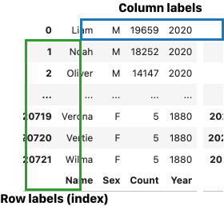
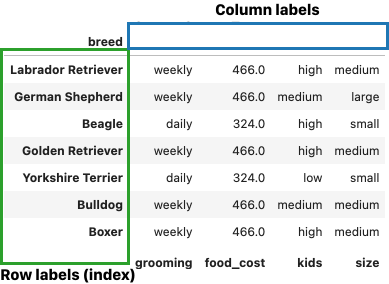
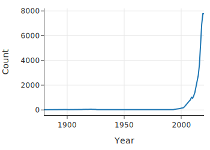
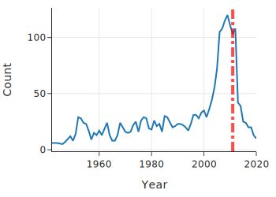
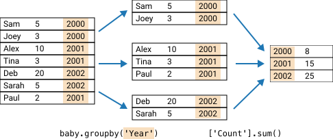
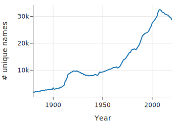
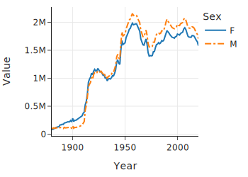
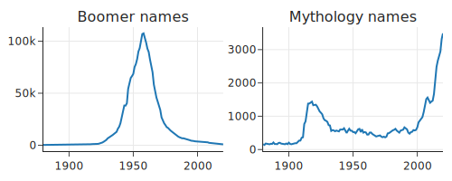
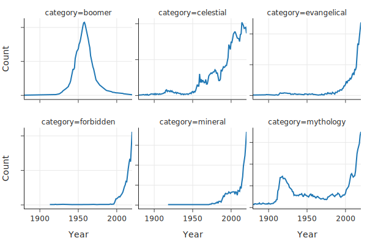
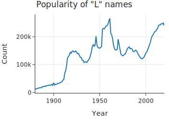

class: middle, center

# 使用 Pandas 处理 DataFrame

---
# 内容

- 子集
- 聚合
- JOIN
- 转换

---
# Pandas 表格数据
- 数据存在“表”里
- 用 Python 表示“表”，一般用 Dataframe
- 一行是一个“记录”（record）
  - 一位同学
- 一列是一个“特征”（feature，计算机领域）、“变量“（variable，统计学领域）
  - 性别
  - 年龄段：“少年”

---
# Pandas 表格数据
- 行列都有“标签”（Label）
  - 行：“爱丽丝”
  - 列：“性别”
- 是有顺序的
  - 第一行，是“爱丽丝”

---
# Pandas
- 操作的两种对象
  - DataFrame
  - Series
- 基本操作
  - slicing
  - filtering
  - sorting
  - grouping
  - joining

---
# 获得子集（ subset ）
- slicing
  - 比如：从 14 列的表中，取 4 列 feature
- filtering
  - 比如：从 1 万行的表中，取 某一个线路的 行

---
# 例：给孩子取名
- 英国哈利王子给女儿取名：Lilibet，为什么？
- 专家分析
  - L 开头的名字，最近流行
  - 70，80后，以 J 开头的流行
- 我们来做一个数据分析

---
# 读入数据
导入 pandas 库，起 别名 pd，写起来短一些

      import pandas as pd
读入 csv 文件

      baby = pd.read_csv('babynames.csv')
四列：Name,	Sex, Count,	Year

---
# 数据 Scope 分析
- 谁收集了这个数据？（Who）
  - 美国社保局
- 他们为什么收集这个数据？（Why）
  - 出生证明
- 数据何时收集的（When）
  - 2021年3月
- 在哪里被收集的（Where）
  - 美国
  
---
# 数据 偏差 分析
- 1879年以后才开始收集
- 1937年后，很多人不去社保局登记
- 一些没有登记出生地的人，不包括在数据里

---
class: middle, center
# 基本观察
.center[.width-60[]]

行标签：从0开始，往上累加

“行标签”也可以是字符串

---
class: middle, center
# 狗狗的类型
- .center[.width-80[]]
  - 这个“行标签”，是“index”
  - pandas 把它存在 pd.Index 里（索引）
  - 它不是数据，不是一“列”

---
# Slicing
- 用 “标签” 和 “位置编号” 来选取行和列
  - 比如：从 14 列的表中，取 4 列
- 就像切土豆片
  - 横切
  - 竖切
- 用 .loc, .iloc
  - .loc： 用 label 选择行或者列

---
# 切一个 Cell
  
      baby.loc[1, 'Name']
  1 是 行 label
  
  “Name” 是 列 label

注意：用 方括号

---
# 切一大“块”
  
      baby.loc[0:3, 'Name':'Count']

---
# 切一列
  
      baby.loc[:, 'Count']
这一列，是一个 pd.Series 对象

      counts = baby.loc[:, 'Count']
      counts.__class__.__name__
      'Series'
很常用，所以可以 缩写 为：baby['Count']

---
# Series 和 DataFrame 区别
- 一维 vs 二维
- 虽然它们有很多方法一样，但是不同的东西
- 不能搞混，会出错

---
# 切几列

      baby.loc[:, ['Name', 'Year']]
很常用，所以可以 缩写 为：

      baby[['Name', 'Year']]

---
# .iloc

类似 loc，但输入的是 “位置” 的编号

      dogs = pd.read_csv('dogs.csv', 
            index_col='breed')
      
      dogs.iloc[0:3, 0:2]
      
      dogs.loc['Labrador Retriever':'Beagle', 
            'grooming':'food_cost']

---
# filtering
- 选出符合要求的行和列
- 比如：从 1万 行的表中，取 某一个线路的 行
- 检查是否满足筛选条件
  - 布尔表达式

---
# filtering
- 布尔表达式

      baby['Year'] == 2020

- 输出 Series：内容 是 布尔型
- 用它作为“位置编号”，来“切”出结果
  
    baby.loc[baby['Year'] == 2020, :]

- 也可以简写为
  
    baby[baby['Year'] == 2020]

---
# sorting

      (baby[baby['Year'] == 2020]
      .sort_values('Count', ascending=False)
      .head(7)
      )

---
# 练习

- 背景
  - Luna 这个女孩名字 2000 年以前还不存在，现在流行了
- 问题
  - Luna 什么时候变流行的？

---
# 设计
 
Filter： 选出 Name = Luna， Sex = Female 的 行

Slice： 切出 Count 和 Year 两列，进行分析

      luna = baby[baby['Name'] == 'Luna']

      luna = luna[luna['Sex'] == 'F']    

      luna = luna[['Count', 'Year']]     

---
class: middle, center
# 线图
.center[.width-70[]]

      px.line(luna, x='Year', y='Count', 
              width=350, height=250)
2000后快速增长

---
# 另一个 Filter 函数：query
简写，比较方便

例：选出 Name = Siri， Sex = Female 的 行

      siri = (baby.query('Name == "Siri"')
              .query('Sex == "F"'))

---
# 画图

线图

      fig = px.line(siri, x="Year", y="Count", 
              width=350, height=250)
加垂直参考线

      fig.add_vline(
          x=2011, line_color="red", line_dash="dashdot", 
              line_width=4, opacity=0.7
      )

---
class: middle, center
# Siri 流行度
.center[.width-70[]]

2011年急剧下降, 为什么？

2011年 苹果公司用了这个名字。哈！

---
# 合并（Aggregating）
- 合并一些行，获得总结
  - 比如：每天一行，今天的销售量
    - 合并统计，这周的总销售量
- 两个常用操作
  - grouping
  - pivoting
- 统计总人数
  - baby['Count'].sum()

---
class: middle, center
# 讨论

基于这个数据，能不能分析出生率随时间的变化？

---
class: middle, center
# 分析

按 Year 合并 baby 数

.center[.width-100[]]

---
# 实现

      baby.groupby('Year')['Count'].sum()
注意：用单括号，因为 groupby 是一个函数
  
sum 也是函数
  
结果是一个 Series， index 索引是 Year

      counts_by_year = baby.groupby('Year')['Count'].sum()
            .reset_index()
reset index 把 Year 从 index 变成 列，方便画图

---
# 出生率随时间的变化
- .center[.width-80[]]
  - 1939年下降，为什么？
  - 1964年上升，为什么？

---
# 统计出现的次数
  
      baby['Year'].value_counts()
结果会排序，从高到低

---
# 多列分组
  
给 groupby 多个列的名字

      counts_by_year_and_sex = (baby
          .groupby(['Year', 'Sex'])
          ['Count']
          .sum()
      )
输出是 一个 “多级index”（两级 index）的 Series

---
# 格式转换
把它转为 dataframe

      counts_by_year_and_sex.to_frame()
结果是一列

reset index

      counts_by_year_and_sex.reset_index()
结果是三列

---
# 其它函数

除了 sum， 还有 size， mean， first， max

      (baby
        .groupby('Year')
        ['Count']
        .max()
      )

---
# 自定义函数

如：获得每组里的 最大值 和 最小值 之间的 距离

输入是一个 series

      def data_range(counts):
          return counts.max() - counts.min()

      (baby
        .groupby('Year')
        ['Count']
        .agg(data_range)
      )

---
# 讨论

      def count_unique(s):
          return len(s.unique())
会产生什么结果？

---
# 每年的不同的名字数

.center[.width-80[]]
 
越来越多

---
# Pivoting
按两列进行分组

很方便地进行按照两个属性的总结

实际中经常用到

      mf_pivot = pd.pivot_table(
          baby,
          index='Year',   # Column to turn into new index
          columns='Sex',  # Column to turn into new columns
          values='Count', # Column to aggregate for values
          aggfunc=sum)    # Aggregation function
输出 dataframe，index 是 year，列是 sex，内容是 人数

---
# 设置图例

      fig.update_traces(selector=1, line_dash='dashdot')
.center[.width-90[]]

---
# 小结
- 汇聚数据
  - groupby()
  - pivot_table()

---
# Joining

- 连接两个表
- 名字表
    - baby_small
      - 神话名字：Julius，  Cassius 正在流行
- 名字类型表
    - nyt_small
      - name
      - category（类型）

---
# inner join
- 从 baby 表的第一行往下，看 name ，如果 这个name 在名字类型表里有，就把 category 加上
- 没有的话呢？

- 第一种选择：就不管这个 name 了
- 这就是 inner join

---
# inner join

.center[.width-100[]]

---
# inner join

      baby_small.merge(nyt_small,
                 left_on='Name',
                 right_on='nyt_name')
  告诉它，用哪两列 join

  注意，新表会有这两列：'Name'，'nyt_name'，虽然它们内容重复

  pandas 还有一个 join 函数，但 merge 函数更灵活。所以用 merge

---
# 第二种选择：left join

以左边的为主，右边没有的话，用 None 来填充

      baby_small.merge(nyt_small,
                 left_on='Name',        
                 right_on='nyt_name',
                 how='left')

类似的，right join
  - 右边的为主

---
# left join

.center[.width-100[]]

左边的为主

---
# 第三种选择：左右的全集

outer join

      baby_small.merge(nyt_small,
                 left_on='Name',        
                 right_on='nyt_name',
                 how='outer')

---
class: middle, center
# 案例

各种类型名字的人数随时间（年份）的变化

---
# 分析
- 先 join
  - inner？left？outer？
- 然后 group
  - 类型
  - 时间（year）
- 然后 合并
  - sum

---
# 代码

      cate_counts = (
          baby.merge(nyt, left_on='Name', 
              right_on='nyt_name') 
          .groupby(['category', 'Year'])                       
          ['Count']                                            
          .sum()                                               
          .reset_index()
      )

---
# 画图

      boomers = px.line(cate_counts
                    .query('category == "boomer"'),
                  x='Year', y='Count')
      
      myths = px.line(cate_counts
                    .query('category == "mythology"'),
                  x='Year', y='Count')

      fig = left_right(boomers, myths, width=500, 
                height=200,
                subplot_titles=['Boomer names', 
                'Mythology names'])
      
      margin(fig, t=30)
      
---
# 画图

两张子图，并排

.center[.width-100[]]
  
神秘类型名字最近流行起来了

---
# 按 category 画子图

      fig = px.line(cate_counts, x='Year', y='Count',
              facet_col='category', 
              facet_col_wrap=3,
              facet_row_spacing=0.15,
              width=600, height=400)
      
      margin(fig, t=30)
      
      fig.update_yaxes(matches=None, showticklabels=False)
facet_col='category' 指定按照 category 分组

---
# 按 category 画子图

.center[.width-100[]]

---
# JOIN 小结
- inner， left， right， outer join
- 画 子图

---
# 变换
- 单位变换，从 米 变为 厘米
- 字符操作

---
class: middle, center
# 案例

如何分析首字母的流行度变化趋势

---
# 算法
- 提取 Name 列的首字母，加 “Name 首字母”的一列
- 然后 group，sum

---
# 方法

对 Series 用 apply 函数

      names = baby['Name']
      names.apply(len)
从第一行起，把每行都做一遍 len 函数

---
# 自定义“变换”函数

自定义函数，提取首字母

      def first_letter(string):
          return string[0]

      names.apply(first_letter)

---
# 两种赋值方法

      letters = baby.assign(Firsts=names.apply(first_letter))
创建新表格 letters，加新列 First

它不会改变 baby

      baby['Firsts'] = names.apply(first_letter)
它会改变 baby，容易带来 bug，使用时注意

---
# 首字母流行度变化趋势

然后 group， count

.center[.width-90[]]

???
      fig = px.line(letter_counts.loc
              [letter_counts['Firsts'] == 'L'],
              x='Year', y='Count',
              title='Popularity of "L" names',
              width=350, height=250)
      fig.update_layout(margin=dict(t=30))

---
# Apply 的缺点

输入一个值，输出一个值，循环地做，慢

      %%timeit

      def decade(yr):
          return yr // 10 * 10

      baby['Year'].apply(decade)
一些数值计算，可以做矩阵运算，更快

      baby['Year'] // 10 * 10
快30倍

---
# 小结
  - apply
  - assign

---
# Dataframe 优势

- 相对 Excel 的优点
  - 可编程，自动化
  - 大数据
- 相对 矩阵运算（numpy）的优点
  - 支持字符串类型
- 相对 关系（SQL）数据库的优点
  - 一般用 pandas 做完预处理，然后送进 SQL 数据库
  - sql 数据库可以很大
  - 一般从 sql 中选出“子集”，然后 pandas 做深入分析（可视化，建立模型）

---
# 小结
- 什么是 dataframe
- 为什么它有用
- Pandas 操作：subset， aggregate，join，transform

---
# 练习

Pandas 练习

textbook-mastercontent/ch/06

1-pandas_subsetting.ipynb
2-pandas_aggregating.ipynb
3-pandas_joining.ipynb
4-pandas_transforming.ipynb

---
# 作业

5-pandas_exercises.ipynb

