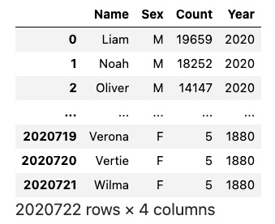
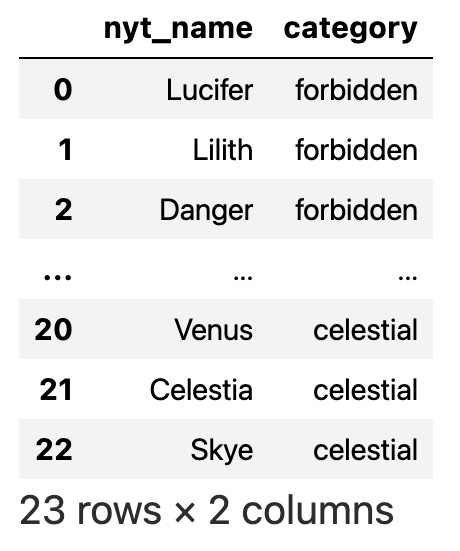

class: middle, center

# 使用 SQL 处理关系

---
# 内容

- Select
- Aggregate
- Join
- Transform
- 多步查询

---
# SQL

- SQL：Structured Query Language
  - 发音：“sequel”
- 表格数据
  - 行：tuple
  - 列：attribute
- 和 Pandas 的 Dataframe 不同
  - 每一行，没有 label
  - “行”没有顺序

---
# 关系代数

- 从集合代数衍生而来
- Projection
- Join

---
# 常用 SQL 数据库

- SQLite
  - python 自带 sql 数据
  - python 标准库：sqlite3
  - sqlalchemy 代码适用其他数据库，更通用
- PostgreSQL
- MySQL

---
class: middle, center

# 例：名字流行度分析

???

DS 100 课本代码

wget https://github.com/DS-100/textbook/archive/refs/heads/master.zip

unzip master.zip

pip install numpy matplotlib pandas seaborn  ipywidgets myst_nb plotly

练习

textbook-mastercontent/ch/07

1-sql_subsetting.ipynb
2-sql_aggregating.ipynb
2-sql_joining.ipynb
4-sql_transforming.ipynb

---
# 加载孩子名字数据库

      import pandas as pd
      import sqlalchemy
      db = sqlalchemy.create_engine(
            'sqlite:///babynames.db')

---
# 观察表格内容

Pandas read_sql 函数
- 运行 sql query，返回 dataframe

      query = ''' 
      SELECT *
      FROM baby;
      '''

      pd.read_sql(query, db)

???

/Users/yishuai/Documents/Course/1-bigdata/研究生新课程/bigalgo/2-ds100/3-book-learn-ds/textbook-master/content/ch/07/babynames.db

---
# Baby 表内容

.center[.width-80[]]

---
class: middle, center

# Select

选取数据

---
# Slice

    SELECT Name FROM baby;
    SELECT Name, Count FROM baby;
    SELECT Name FROM baby LIMIT 10;

---
# Filter

    SELECT * FROM baby WHERE Year = 2020;

是用 一个 “等号”，不是 两个等号 “==”

---
# LIKE

    SELECT * FROM baby WHERE Name LIKE 'a__%';

指定字符串模式，两种可能的通配符：
  - 下划线 _：任意一个字母
  - 百分号 %：任意字符串，包括空字符串
  - 'a__%’：a 开头，后面有至少 2 个字母

---
# OR，AND

      SELECT * FROM baby
      WHERE Count > 10000
        AND (Year = 2020
            OR Year = 2019);
用括号来控制计算顺序

---
# SORT

      SELECT *
      FROM baby
      WHERE Year = 2020
      ORDER BY Count DESC
      LIMIT 10;

---
# DISTINCT

      SELECT DISTINCT(Year)
      FROM baby

去掉重复的值

---
class: middle, center

# 聚合

---
# 聚合

求总数

      SELECT SUM(Count)
      FROM baby

---
# 按一列进行分组聚合

求总数

      SELECT Year, SUM(Count)
      FROM baby
      GROUP BY Year

注意：
  - 结果中，Year 是一列，因为 SQL 表的行，没有 Label
  - 而在 pandas， Year 是 Index，不是一列

---
# 下面的语句对吗？

      SELECT Year, Sex, SUM(Count)
      FROM baby
      GROUP BY Year

不对

- 因为 Sex 不确定
- 虽然 SQLite 不会报错，但其他 DB 会。所以不建议

---
# 按多列分组聚合

      SELECT Year, Sex, SUM(Count)
      FROM baby
      GROUP BY Year, Sex

提示：可以用 unstack() 转换结果的 dataframe

---
# 其他聚合函数

COUNT, AVG, MIN, and MAX

不同 DB 函数多少不一。PostgreSQL 函数最多

---
# HAVING

和 WHERE 类似，但只和 aggregations/GROUP BY 一起使用

      SELECT Year, Count(*), Avg(Count)
      FROM baby
      GROUP BY Year
      HAVING COUNT(*) > 10

---
class: middle, center

# Join

联合

---
# 名字类别表

.center[.width-60[]]

---
# INNER JOIN

保留交集

      SELECT *
      FROM baby_small INNER JOIN nyt_small
        ON baby_small.Name = nyt_small.nyt_name

---
# LEFT JOIN

左边的表的内容全部保留，把右边的表 Join 过来，如果没有的话，就填 None

      SELECT *
      FROM baby_small LEFT JOIN nyt_small
        ON baby_small.Name = nyt_small.nyt_name

---
# JOIN

- SQLite 不支持 右 Join
  - 怎么办？
  - 换一下顺序呗

- SQLite 不支持 Outer Join
  - 没事。不常用

---
class: middle, center

# 课堂练习

## 统计名字类型的流行度变化

---
# 统计名字类型的流行度变化

目标：
- 构造一张表：类型，Count，Year

方法：
- 先 Join 两张表，得到 Count，Year，Category
  - Inner Join
- 然后对 Category 和 Year 做 Count 的 Sum

---
# 统计名字类型的流行度变化

      SELECT
        category,
        Year,
        SUM(Count) AS count
      FROM baby INNER JOIN nyt
        ON baby.Name = nyt.nyt_name
      GROUP BY category, Year

---
class: middle, center

# Transform

变换

---
# 取内容字符串的长度

      SELECT Name, LENGTH(Name)
      FROM baby
      LIMIT 10;

---
# 取子字符串

      SELECT Name, SUBSTR(Name, 1, 1)
      FROM baby
      LIMIT 10;

---
# 重命名

Alias 别名

      SELECT *, SUBSTR(Name, 1, 1) AS Firsts
      FROM baby
      LIMIT 10;

---
class: middle, center

# 多步查询

---
# With 从句链式查询

- 多步查询，创建中间表
  - 通过 AS 给 select query 获得的中间表，一个名字
  - 然后对这个中间表，继续操作
- 这样就可以构造“链式”查询

---
# With 从句链式查询

      WITH letters AS (
        SELECT *, SUBSTR(Name, 1, 1) AS Firsts
        FROM baby
      )
      SELECT Firsts, Year, SUM(Count) AS Count
      FROM letters
      WHERE Firsts = "L"
      GROUP BY Firsts, Year;

---
# IN

用 Select 结果做条件，要求取值在其中

      SELECT Name
      FROM baby_small
      WHERE Name IN
        (SELECT Name
         FROM nyt_small
         WHERE Name LIKE '%Anny%'
        )

---
# ALL

用 Select 结果做条件，要求对其中所有取值都适用

      SELECT Name
      FROM baby_small
      WHERE Count >= ALL
        (SELECT Count
         FROM baby_small
         WHERE Name LIKE '%Anny%'
        )

---
# ANY

用 Select 结果做条件，要求对其中任意一个适用就可以

      SELECT Name
      FROM baby_small
      WHERE Count >= ANY
        (SELECT Count
         FROM baby_small
         WHERE Name LIKE '%Anny%'
        )

---
# EXISTS

两个集合的交集（EXISTS），或者差集（NOT EXISTS）

      SELECT Name
      FROM baby_small b
      WHERE NOT EXISTS
        (SELECT *
         FROM nyt_small
         WHERE Name = b.Name
        )

---
class: middle, center

# Jupyter SQL Magic

在 Jupyter Notebook 中，直接使用 SQL

???

https://github.com/cliburn/bios-823-2021

1-notebooks/A07_Relatinoal_Databases.ipynb

用的 magic

---
# 安装必要的包

安装 ipython-sql 扩展和数据库驱动（例如 SQLite 驱动）。

! pip install ipython-sql sqlalchemy

如果使用不同的数据库，安装相应的数据库驱动。例如 MySQL：

pip install pymysql

---
class: middle, center
# 加载 SQL Magic

%load_ext sql

---
class: middle, center
# 连接到 SQLite 数据库

%sql sqlite:///example.db

---
class: middle, center
# SQL 操作

在 Cell 的第一行输入：

%%sql

然后就可以写 SQL 语句了

---
# 例

创建一个示例表并插入数据

      %%sql
      CREATE TABLE IF NOT EXISTS users (
          id INTEGER PRIMARY KEY,
          name TEXT,
          age INTEGER
      );

      INSERT INTO users (name, age) VALUES
         ('Alice', 30), ('Bob', 25), ('Charlie', 35);

      SELECT * FROM users;

非常方便

---
class: middle, center

# 课后练习

---
# 基本练习：DS100 课本附属练习

访问 https://github.com/DS-100/textbook/tree/master/content/ch/07 目录下的 Jupyter Notebook

练习这些 Jupyter Notebook，复习课上学过的内容

完成作业 sql_exercises.ipynb

---

# 扩展练习 1：BROWN 大学练习 I

上传 [2-SQL-Lab.zip](../zip/2-SQL-Lab.zip)，解压，打开 sql_stencil.ipynb

完成下面的练习

---
# 练习 I：sqlite3 基本操作
- 打开数据库，查看其中的表，表的 Schema，表中的记录
- 创建新表

---
# 练习 II，人际关系分析

三个表
- 职业信息
- 爱慕关系
  - 单向
- 好友关系
  - 双向

---
# 练习 II，人际关系分析

- 名字排序
- 职业筛选
- 有人喜欢的人
- 没人喜欢的人
- 职业人数统计

---
# 练习 III，IV，V，数据库设计

两个表：学生、课程
- PRIMARY Key/Foreign Key
- Schema 设计
- 创建和修改数据库
- 插入、删除和更新记录

---
# 练习 VI，高级查询练习

- Having
- Join
- With
- Case

???

[Brown 课程 SQL Queries PPT](https://static.us.edusercontent.com/files/Qlb9gMRfR2Ca494letqTo95J)，讲得非常好

Brown 2021
  ER and SQL
    https://drive.google.com/file/d/1jIP8Vj_qpCT8xQ50Y2hfVhUC2PWOKnqq/view?usp=sharing
  More SQL
    https://drive.google.com/file/d/1NegV2b_tlSh9DYE27OL_eVQ1C0AehBCq/view?usp=sharing

---
# 扩展练习 2：BROWN 大学作业 II

下载 [hw1-sql.zip](../zip/hw1-sql.zip)，完成下列练习

- 人际关系分析
- TMDB 电影数据集分析
- 运动员数据查询优化

---

# 扩展练习 3: Duke 大学 BIOS 823

访问 https://github.com/cliburn/bios-823-2021/tree/main/notebooks

完成下面的练习

---
# 练习 I: Overview

A07_Relatinoal_Databases.ipynb
- Concepts
- Design
- Database administration
- CRUD: Create, Read, Update, Delete
- Database normalization
- OLTP and OLAP
- Generating ER diagrams
- Robustness and scaling

---
# 练习 II：Query

A08_SQL_Queries_01
- Data
- Basic Structure
- User defined functions (UDF)

---
# 练习 III：Query

A09_SQL_Queries_02
- Create toy data set
- Subqueries
- Common table expressions (CTE)
- Window Functions

???

工具

https://sqlfiddle.com/

https://sqlfiddle.com/sqlite/online-compiler

高级

把查询结果存到 Pandas 变量里，后续处理

参见 DS100 Lec 20、21 代码和笔记

https://ds100.org/course-notes/sql_I/sql_I.html

https://ds100.org/course-notes/sql_II/sql_II.html

DS100 Lab 10，基于 duckdb，没跑通

包括
- IMDB
- FEC

ds100 lec20，note20，lab10，hw07，disc11

[SQL Review Slides](https://docs.google.com/presentation/d/1mLVkQxah9asdKhnTNpcUSYBOuKGSWE_d3MJ5nYuTw9U/edit?usp=sharing)

[SQL Cheat Sheet](https://websitesetup.org/sql-cheat-sheet/)， Luke Harrison, a former Data 100 student.

---
# 作业：职场练习

- 你心仪职位的职责中，有没有需要做 SQL 相关工作的？请举一个例子
- 针对上述例子，基于课后练习的代码和数据，构造示例数据，实现对应的 SQL，并测试通过。简述设计思路。
- 按 STAR 原则，就上述工作写作 50 字的简历内容。简历内容需要言简意赅，很有吸引力。具体要求请参见《AI 帮工作 1：求职和申请》教程的 7-11 页，[链接](https://yishuai.github.io/talk/ai-career/index.html?p=4-1-apply.md#7)
- 作业提交链接：[作业：用 SQL 处理关系](https://docs.qq.com/form/page/DT1JUUGp1R2ZnY29K)
- 提示：请全程由 AI 辅助

---
class: middle, center

# 参考材料：SQL Cheat Sheet

浏览 Wu Dun 的 [SQL Cheat Sheet](https://dunwu.github.io/db-tutorial/pages/e438a7/#sum-%E8%BF%94%E5%9B%9E%E6%95%B0%E5%80%BC%E5%88%97%E7%9A%84%E6%80%BB%E5%92%8C)，对其中你感兴趣的语句，询问 AI，弄懂其用法。

