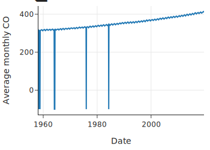
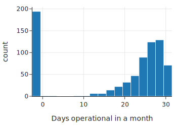
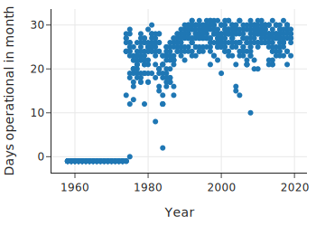
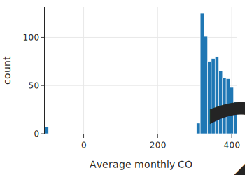
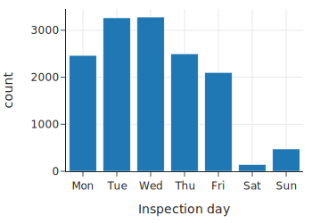
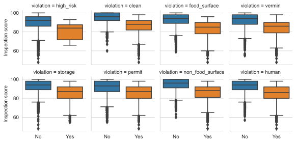

class: middle, center

# DataFrame 数据整理

---
# 内容

- 示例1：整理 Mauna Loa 天文台的 CO 2 测量
  - 质量检查
  - 缺失值和记录的处理
  - 转换时间戳
  - 表结构调整
- 示例：整理餐厅安全违规行为

---
# Dataframe 准备
- 评估质量，修正问题
- 验证数据有效性
- 数据变换，变形

---
# 四种数据

- 来自科学实验或研究的数据
  - 干净、有详细记录、结构简单，目的是共享，其他人可以重现。立刻就可以进行分析
- 来自政府调查的数据
  - 通常附带详细的说明和元数据，描述如何收集和格式化数据。可以立即用于探索和分析
- 来自管理部门的统计数据
  - 干净，但由于我们的目的和这些数据最初收集的目的不同，需要了解它的Scope，检查其质量，转换特征
- 非正式收集的数据（例如从网络上抓取的数据）
  - 可能非常混乱，很少有说明。例如推文、博客和维基百科。需要格式化和清理

---
# 四步
- 评估数据质量
- 处理缺失值
- 变换特征
- 修改数据结构和粒度

---
# 示例：二氧化碳测量数据整理

检查数据大小，编码格式

      from pathlib import Path
      import os
      import chardet

      co2_file_path = Path('data') / 'co2_mm_mlo.txt'

      [os.path.getsize(co2_file_path), 
      chardet.detect(co2_file_path.read_bytes())['encoding']]

---
# 观察

观察前几行，看有没有说明文字，表头

        lines = co2_file_path.read_text().split('\n')
        len(lines)
        lines[:6]
再观察 lines[69:75]

发现：前面有说明，数据从第 72 行开始，没有表头，空白分隔

---
# 读入

从第 72 行开始，指定表头（列的名字）

        co2 = pd.read_csv('data/co2_mm_mlo.txt', 
                  header=None, 
                  skiprows=72, 
                  sep='\s+',
                  names=['Yr', 'Mo', 'DecDate', 
                    'Avg', 'Int', 'Trend', 'days'])
可视化

      px.line(co2, x='DecDate', y='Avg', 
          width=350, height=250,
          labels={'DecDate':'Date', 
            'Avg':'Average monthly CO2'})
---
# 数据观察

.center[.width-90[]]
问题：四个负值，不合理

---
# 观察 percentile

      co2.describe()[3:]
- 显示 min，25%，50%，75%，max
- 发现有 -99.99， -1
- 为什么？
  - 读文件前面的说明
  - 代表 Missing 缺失值
- 启发
  - 要读文档啊
  - 要检查数据质量啊

---
# 质量检查

检查数据量

从 March 1958 到 August 2019， 应该有 12 * (2019-1957) - 2 - 4 = 738 记录

    co2.shape

观察 12 个月，每个月的数据量

    co2["Mo"].value_counts().reindex(range(1,13)).tolist()
    px.histogram(co2, x='days', width=350, height=250,
            labels={'days':'Days operational in a month'})

---
# 每月数据量分布

.center[.width-80[]]

很多 -1（不合理），很多 28，29天（合理）

---
# 每月数据量散点图

      px.scatter(co2, x='Yr', y='days', 
              width=350, height=250,
              labels={'Yr':'Year', 
                  'days':'Days operational in month' })
.center[.width-70[]]

---
# 二氧化碳浓度分布

      px.histogram(co2, x='Avg', width=350, height=250,
            labels={'Avg':'Average monthly CO2'})
.center[.width-60[]]

有少量 -99.99

---
# 观察

筛选 -99.99 出来看一下

      co2[co2["Avg"] < 0]
有 7 个，是 缺失值

怎么补上？

  根据波形，交织 interpolate

---
# 按年做平均

      co2_ann = co2.groupby('Yr')['Int']
            .mean().reset_index()

      px.line(co2_ann, x='Yr', y='Int', 
            height=250, width=350,
            labels={'Yr':'Year', 
              'Int':'Average annual CO2' })

---
# 检查质量
- 四个问题
- Scope
  - 这些数据符合您对目标人群（population）的理解吗？
- 测量和数值
  - 数值是否合理？
- 关系
  - 相关特征是否一致？
- 分析
  - 哪些特征可能对未来的分析有用？

---
# Scope

- 目标人群， access frame， sample
  - 符合您对人群（population）的理解？
  - 有代表性？

例：观察邮编的分布

        bus['postal_code'].value_counts().tail(10)
- 发现邮编里有 不是 941 开头的
  - 位置不对

---
# 测量和数值
- 数值是否合理？
- 背景知识说 ppm 是 400 左右
  - 检查值是否合理

---
# 关系
  
相关特征是否一致？

      display_df(pd.crosstab(dawn['age'], dawn['type']),
           rows=12)
观察：type 为 3 的 age 都小于 21

---
# 分析
- 哪些feature可能对未来的分析有用？
- 统计 值的分布
  - 例：pd.value_counts(insp['type'])
  - 很多缺失值的 feature
  - 很少不同值 的 feature

---
# 缺失值的处理办法
- 不动
- 改值
- 不要这一列
- 不要这一行

---
# 缺失值
- 用一个合理的值代替（imputation）
- Deductive
  - 根据逻辑关系，填充
  - 如：位置是“北京”，就用北京的经纬度来填充“经纬度”
- 用均值填充
- hot-deck：随机填充

---
# 日期和时间转换

整数日期转换为内置 pd.Timestamp，准确到 ns

如不指定格式， to_datetime 推测格式，但可能错

      date： 20160513
      insp['date'].dtype
        int64

      date_format = '%Y%m%d'
      insp_dates = pd.to_datetime(insp['date'], 
            format=date_format)
      
      insp_dates[:1]
      0   2016-05-13
      Name: date, dtype: datetime64[ns]

---
# pd.Timestamp 结构

用 dt 提取 pd.Timestamp 中的各种时间相关信息

如

        insp_dates.dt.year[:3]

        insp_dates.dt.dayofweek

---
# Day of Week 统计

    insp = insp.assign(timestamp=insp_dates,
                      dow=insp_dates.dt.dayofweek)

    fig = px.bar(insp['dow'].value_counts().reset_index(),
                x='dow', y='count',
                labels={'dow':'Inspection day'},
                height=250, width=350)

    day = ['Mon','Tue','Wed','Thu','Fri','Sat','Sun']
    fig.update_xaxes(ticktext=day, 
            tickvals=np.arange(0, 7, 1))
    fig.update_layout(showlegend=False)

---
# Day of Week 统计

.center[.width-80[]]

发现：周末检查很少

---
# pipe 程序执行方式

流水线多个变换

      date_format = '%Y%m%d'

      def parse_dates_and_years(df, column='date'):
          dates = pd.to_datetime(df[column], 
                  format=date_format)
          years = dates.dt.year
          return df.assign(timestamp=dates, year=years)

      def extract_day_of_week(df, col='timestamp'):
          return df.assign(dow=df[col].dt.day_of_week)

      insp = (pd.read_csv("data/inspections.csv")
              .pipe(parse_dates_and_years)
              .pipe(extract_day_of_week))

---
# 宽表和长表
- 宽表：一行 多个值
- 长表：一行 一个值

.center[.width-70[]]

---
# 宽表

- 当我们希望读者查看数据表本身时（例如在经济学文章或新闻报道中），宽表 方便
- 机器学习用宽表

.center[.width-70[]]

---
# 长表

- 长表也叫 tidy data，更容易 aggregate
  - 例如，按年或月进行分组
- 对 数据分析 更有用

.center[.width-70[]]

---
# 宽表变长表

指定长表的列名

      co2_long = co2_wide.melt(id_vars=['Yr'],
                      var_name='month',
                      value_name='average')
.center[.width-60[]]

---
# 长表变宽表

指定长表的列名

      co2_pivot = pd.pivot_table(co2[10:34],
          index='Yr',   # Column to turn into new index
          columns='Mo',  # Column to turn into new columns
          values='Avg') # Column to aggregate 

      co2_wide = co2_pivot.reset_index()
.center[.width-40[]]

# 内容

- 示例1：整理 Mauna Loa 天文台的 CO 2 测量
- .red[示例2：整理餐厅安全违规行为]

---
# 探索问题

分析：低分餐馆，都犯了哪些错？

首先，选取一年数据，减少数据量

      def subset_2016(df):
          return df.query('year == 2016')

      vio2016 = viol.pipe(subset_2016)
      ins2016 = insp.pipe(subset_2016)

---
# 问题表
统计 问题表中，餐馆 单天 出现的 问题 次数

      num_vios = (vio2016
            .groupby(['business_id', 'timestamp'])
            .size()
            .reset_index()
            .rename(columns={0: 'num_vio'}));

---
# 检查表 和 问题表 合并
  left join

      def left_join_vios(ins):
          return ins.merge(num_vios, 
            on=['business_id', 'timestamp'], how='left')

      ins_and_num_vios = ins2016.pipe(left_join_vios)
      ins_and_num_vios

---
# 没有 问题 的 检查

left join，会是 NULL

      ins_and_num_vios['num_vio'].isnull().sum()
得满分 的，把 问题数 设为 0

      def zero_vios_for_perfect_scores(df):
          df = df.copy()
          df.loc[df['score'] == 100, 'num_vio'] = 0
          return df

      ins_and_num_vios = (ins2016.pipe(left_join_vios)
                    .pipe(zero_vios_for_perfect_scores))

---
# 问题数 和 分数 的 相关性

      fig = px.strip(
          ins_and_num_vios,
          x=jitter(ins_and_num_vios['num_vio'], amt=0.5),
          y='score',
          width=400, height=250)

      fig.update_traces(marker=dict(opacity=0.5, size=4))

      fig.update_layout(xaxis_title="Number of violations",
                  yaxis_title="Inspection score")

---
# 问题数 和 分数 的 相关性

.center[.width-80[]]
  
负相关， 但分布很宽
  - 说明有一些问题比另一些问题严重

---
# 提取文本中的信息

观察 问题描述 文本 的 特点

      display_df(
          vio2016['description']
            .value_counts()
            .head(15)
            .to_frame(),
          rows=15)

---
# 提取关键字，获得 Violation

一系列新特征

    def make_vio_categories(vio):
        def has(term):
            return vio['description'].str.contains(term)

    return vio[['business_id', 'timestamp']].assign(
        high_risk        = has(r"high risk"),
        clean            = has(r"clean|sanit"),
        food_surface     = (has(r"surface") & has(r"\Wfood")),
        vermin           = has(r"vermin"),
        storage          = has(r"thaw|cool|therm|storage"),
    )

    vio_ctg = vio2016.pipe(make_vio_categories)
    vio_ctg

---
# Violation 表 和 检查表 合并

与检查表合并， 设 100分检查 的 feature 值 为 0

    feature_names = ['high_risk', 'clean', 
            'food_surface', 'vermin', 'storage']

    def left_join_features(ins):
        return (ins[['business_id', 'timestamp', 'score']]
                .merge(vio_counts, on=['business_id', 
                'timestamp'], how='left'))

    def zero_features_for_perfect_scores(ins):
        ins = ins.copy()
        ins.loc[ins['score'] == 100, feature_names] = 0
        return ins

    ins_and_vios = (ins2016.pipe(left_join_features)
                    .pipe(zero_features_for_perfect_scores))

---
# 观察 分数 和 Violation 的关系

画不同 Violation 的 分数 box 图

先变为 长表， violation 变为 一列，里面 是 vio 类型

      features = ins_and_vios.melt(id_vars=
          ['business_id', 'timestamp', 'score'],
          var_name='violation', 
          value_name='num_vios')

      features['vio'] = features['num_vios'] > 0

      any_vio = {False:"No", True:"Yes"}

      features['vio'] = features['vio'].map(any_vio)

---
# 观察 分数 和 Violation 的关系

画 box 图。 根据 violation 列 画 子图

      g = sns.catplot(data=features, 
            x='vio', y='score',
            col='violation', 
            col_wrap=4, 
            kind='box', 
            height=2)

      g.set_axis_labels( "" , "Inspection score");
由此 可以看出 长表 的 好处！

---
# 观察 分数 和 Violation 的关系

8 种 Violation，出现（Yes）和 不出现（No）时的分数分布（出现时，分数低）

.center[.width-100[]]
  

---
# 总结
- 数据 质量检查， 整理，分析
- 坏值、缺失值 处理
  - 检查 总结统计、分布、value counts
  - 逻辑表达式 检查

---
# 最重要的
- 保持 对 数据 的 好奇！
- Dig deeper
  - Issue 是大，还是小？
  - 理解和解释不同寻常的现象
  - 是不是数据的一个限制？

---
# 练习

textbook-mastercontent/ch/09

1-wrangling_co2.ipynb
2-wrangling_transformations.ipynb
3-wrangling_structure.ipynb
4-wrangling_restaurants.ipynb